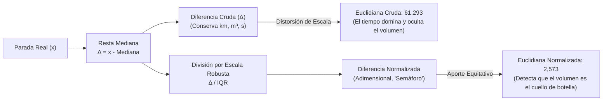
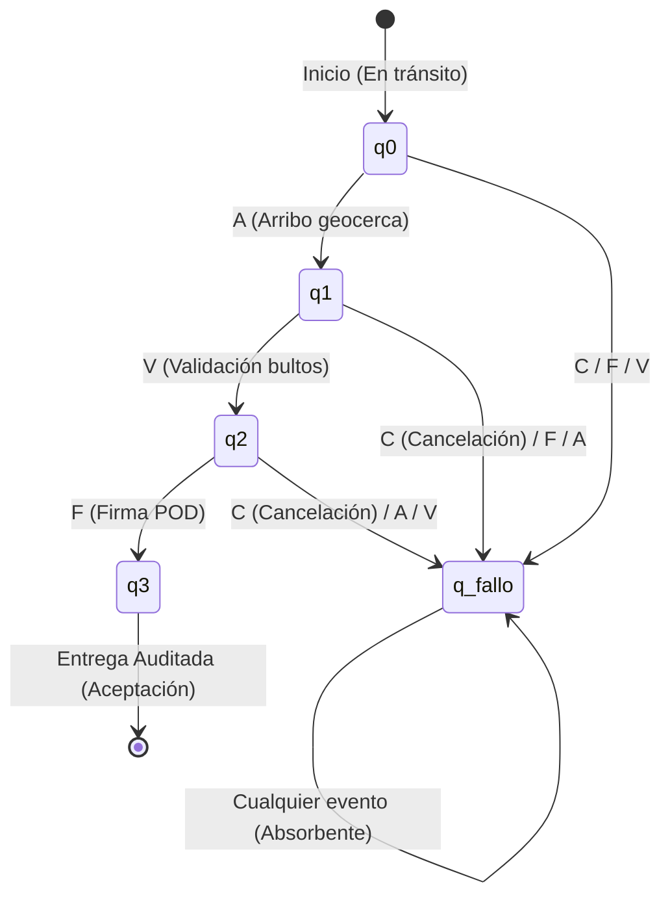

# Guía Integral de Estudio y Sustentación: Representaciones, API y Arquitectura

> **Proyecto:** IA Logística Amazon Last Mile — Detección y Reconocimiento de Patrones  
> **Ámbitos cubiertos:** `src/representaciones/` (Núcleo matemático, simbólico y secuencial), Dudas avanzadas de Python, `api/` (FastAPI, DTOs, Caché) y `dashboard/` (React 19, Arquitectura y Estado).

---

## Tabla de Contenido

1. [Fase 1 y 3: Fundamentos de Python y `src/representaciones/`](#1-fase-1-y-3-fundamentos-de-python-y-srcrepresentaciones)
   - [1.1 `from __future__ import annotations` (PEP 563)](#11-from-__future__-import-annotations-pep-563)
   - [1.2 El objeto `Ellipsis` (`...`) y tipado de tuplas](#12-el-objeto-ellipsis--y-tipado-de-tuplas)
   - [1.3 `@dataclass(frozen=True)` e inmutabilidad profunda](#13-dataclassfrozentrue-e-inmutabilidad-profunda)
   - [1.4 `self` frente a `this` en Java, Go y Rust](#14-self-frente-a-this-en-java-go-y-rust)
2. [Representación Numérica: `src/representaciones/numerica.py`](#2-representación-numérica-srcrepresentacionesnumericapy)
   - [2.1 El Espacio Vectorial $\mathbb{R}^3$ y Metadatos](#21-el-espacio-vectorial-mathbbr3-y-metadatos)
   - [2.2 Desempaquetado de Argumentos (`*` Unpacking vs Spread)](#22-desempaquetado-de-argumentos--unpacking-vs-spread)
   - [2.3 Validación y el método `.tolist()`](#23-validación-y-el-método-tolist)
   - [2.4 Matemática de la Distancia: Cruda vs Normalizada ($\Delta$ vs $\Delta / \text{IQR}$)](#24-matemática-de-la-distancia-cruda-vs-normalizada-delta-vs-delta--textiqr)
   - [2.5 Diagnóstico Causal y Desglose Cuadrático (`np.square`)](#25-diagnóstico-causal-y-desglose-cuadrático-npsquare)
   - [2.6 Ejercicio Real con Números del Dashboard (Paso a Paso)](#26-ejercicio-real-con-números-del-dashboard-paso-a-paso)
3. [Representación Simbólica: `src/representaciones/simbolica.py`](#3-representación-simbólica-srcrepresentacionessimbolicapy)
   - [3.1 ¿Por qué usar el Percentil 75 ($P_{75}$ / $Q_3$)?](#31-por-qué-usar-el-percentil-75-p_75--q_3)
   - [3.2 La Clase `UmbralDatos` como Puente Numérico $\to$ Simbólico](#32-la-clase-umbraldatos-como-puente-numérico-to-simbólico)
   - [3.3 Arquitectura de un Sistema Experto](#33-arquitectura-de-un-sistema-experto)
   - [3.4 Inferencia Lógica, Trazabilidad y Explicabilidad](#34-inferencia-lógica-trazabilidad-y-explicabilidad)
4. [Representación Secuencial: `src/representaciones/automata.py`](#4-representación-secuencial-srcrepresentacionesautomatapy)
   - [4.1 Protocolo POD (Proof of Delivery)](#41-protocolo-pod-proof-of-delivery)
   - [4.2 La 5-Tupla Formal del AFD: $M = (Q, \Sigma, \delta, q_0, F)$](#42-la-5-tupla-formal-del-afd-m--q-sigma-delta-q_0-f)
   - [4.3 La Navaja de Ockham en el Diseño del Autómata](#43-la-navaja-de-ockham-en-el-diseño-del-autómata)
   - [4.4 ¿Por qué `q_fallo` es un Estado Absorbente?](#44-por-qué-q_fallo-es-un-estado-absorbente)
5. [Orquestación y Fachada: `src/representaciones/reconocimiento.py`](#5-orquestación-y-fachada-srcrepresentacionesreconocimientopy)
   - [5.1 Patrón Fachada (Facade)](#51-patrón-fachada-facade)
   - [5.2 Funciones de Consulta Unificada](#52-funciones-de-consulta-unificada)
6. [Fase 2: Capa API (FastAPI)](#6-fase-2-capa-api-fastapi)
   - [6.1 Arquitectura Limpia en 3 Capas](#61-arquitectura-limpia-en-3-capas)
   - [6.2 Contratos DTO con Pydantic vs Java y C#](#62-contratos-dto-con-pydantic-vs-java-y-c)
   - [6.3 Expresiones Regulares de Seguridad en el DTO](#63-expresiones-regulares-de-seguridad-en-el-dto)
   - [6.4 Decoradores en Python y Optimización con `@lru_cache`](#64-decoradores-en-python-y-optimización-con-lru_cache)
   - [6.5 Controladores, Códigos de Estado (`503` vs `422`) y Encadenamiento](#65-controladores-códigos-de-estado-503-vs-422-y-encadenamiento)
7. [Frontend: `dashboard/` (React 19 + Vite)](#7-frontend-dashboard-react-19--vite)
   - [7.1 Stack Tecnológico](#71-stack-tecnológico)
   - [7.2 Estado Local (`useState`) vs React Context / Redux](#72-estado-local-usestate-vs-react-context--redux)
   - [7.3 Flujo de Vida y Consumo de Servicios (`api.js`)](#73-flujo-de-vida-y-consumo-de-servicios-apijs)
   - [7.4 Hoja de Ruta: Zustand y Persistencia Aislada para el Proyecto Final](#74-hoja-de-ruta-zustand-y-persistencia-aislada-para-el-proyecto-final)

---

## 1. Fase 1 y 3: Fundamentos de Python y `src/representaciones/`

### 1.1 `from __future__ import annotations` (PEP 563)

#### ¿Qué es?
Introducida en PEP 563 (Python 3.7+), activa la **evaluación pospuesta o diferida (*postponed/lazy evaluation*)** de las anotaciones de tipos.

En Python tradicional, cada anotación de tipo se ejecuta inmediatamente en tiempo de importación (*runtime*). Con esta directiva, Python **no ejecuta las anotaciones**, sino que las guarda como simples cadenas de texto literales (*strings*) dentro del diccionario `__annotations__`.

#### ¿Es como JavaScript / TypeScript?
* **TypeScript:** Los tipos son puramente de tiempo de compilación. En runtime se destruyen por completo (*type erasure*).
* **Python:** Los tipos **sí existen en runtime** dentro de `__annotations__`, y librerías como Pydantic y FastAPI los leen en vivo para validar datos.

#### ¿Es asíncrono?
**No.** No tiene relación con el *Event Loop*, hilos ni `async/await`. Es una evaluación **diferida o perezosa (*lazy*)**: la expresión solo se analiza si una herramienta externa (mypy, Pydantic, IDE) solicita inspeccionarla explícitamente.

#### ¿Cómo se usa y por qué la usamos?
Debe ser obligatoriamente la **primera instrucción ejecutable** del archivo:

```python
# Encabezado / Docstring
from __future__ import annotations

from dataclasses import dataclass
...
```

**Beneficios en nuestro proyecto:**
1. **Referencias hacia adelante (*Forward References*):** Permite que un método de `VectorParada` devuelva `VectorParada` sin comillas y sin lanzar `NameError`.
2. **Sintaxis limpia moderna:** Permite escribir `tuple[str, ...]`, `list[dict]` o `int | None` sin importar `Tuple`, `List`, `Union` de `typing`.
3. **Prevención de ciclos de import:** Los archivos pueden referenciar tipos entre sí sin bloquearse al arrancar.
4. **Tiempo de arranque (*Startup Performance*):** El servidor FastAPI no gasta ciclos de CPU evaluando árboles de tipos en el arranque.

---

### 1.2 El objeto `Ellipsis` (`...`) y tipado de tuplas

En Python, la sintaxis `tuple[Tipo, ...]` utiliza formalmente el objeto singleton built-in **`Ellipsis`** (tipo `ellipsis`).

#### Diferencia fundamental con las listas:
* `list[str]`: En Python una lista siempre es de longitud variable y homogénea.
* `tuple[str, int]`: Por defecto, una tupla modela una estructura de **longitud fija y tipos heterogéneos** (exactamente 2 elementos: un texto y un entero).
* `tuple[str, ...]`: El `...` le indica al inspector de tipos: *"Esta tupla es de **longitud arbitraria (0, 1, 10 o más)** y todos sus elementos son de tipo `str`"*.

```python
@dataclass(frozen=True)
class ReglaRepresentacion:
    accion: str
    premisas: tuple[str, ...]  # Tupla inmutable con cualquier número de premisas
    descripcion: str
```

#### Comparación con el operador `...` de JavaScript:
* **En JavaScript:** `...` es el **operador Spread / Rest** (desempaqueta arrays/objetos o reúne parámetros).
* **En Python:** El spread/rest de JS **NO es `...`**, sino el asterisco `*` (para iterables/argumentos) y `**` (para diccionarios). En Python, `...` es un valor/objeto (`Ellipsis`), usado en tipado, rebanado matricial en NumPy (`matriz[..., 0]`) o como equivalente a `pass`.

---

### 1.3 `@dataclass(frozen=True)` e inmutabilidad profunda

Decorar una clase con `@dataclass(frozen=True)` genera automáticamente clases declarativas con dos propiedades clave:

1. **Inmutabilidad estricta (*Read-Only*):**
   Cualquier intento de modificar un atributo tras instanciar lanza `dataclasses.FrozenInstanceError`. Equivale a `Object.freeze()` en JS o `readonly` en C#/TypeScript.
   ```python
   v = VectorParada(15.4, 0.2, 180.0)
   v.distancia_deposito_km = 99.0  # ❌ FrozenInstanceError
   ```
2. **Objeto Hashable (Apto para `set` y claves de `dict`):**
   Python genera automáticamente el método `__hash__()`. Permite crear conjuntos de reglas únicas (`set`) o colecciones congeladas (`frozenset`).
3. **Inmutabilidad Profunda combinada:**
   Como `frozen=True` solo congela los atributos de primer nivel (*shallow freeze*), usar `tuple[str, ...]` para `premisas` (en lugar de una lista mutable `list[str]`) garantiza que el objeto quede 100% blindado contra mutaciones.

---

### 1.4 `self` frente a `this` en Java, Go y Rust

| Lenguaje | ¿Declaración explícita en firma? | Sintaxis | Comportamiento |
| :--- | :---: | :--- | :--- |
| **Java** | ❌ **Implícito** | `void setX(int x) { this.x = x; }` | El compilador inyecta la referencia a la instancia automáticamente. |
| **JavaScript** | ❌ **Implícito** | `setX(x) { this.x = x; }` | Implícito en la firma, resuelto dinámicamente según el contexto de invocación. |
| **Python** | ✅ **Explícito** | `def set_x(self, x): self.x = x` | El primer parámetro debe representar explícitamente a la instancia (por convención `self`). |
| **Rust** | ✅ **Explícito** | `fn set_x(&mut self, x: i32)` | Debe declararse obligatoriamente `&self` o `&mut self` como primer argumento en el bloque `impl`. |
| **Go** | ✅ **Explícito** | `func (v *Vector) SetX(x int)` | Se declara como un *Receiver* (receptor) previo al nombre del método. |

---

## 2. Representación Numérica: `src/representaciones/numerica.py`

### 2.1 El Espacio Vectorial $\mathbb{R}^3$ y Metadatos

Cada parada real del dataset de Amazon Last Mile (14.411 paradas curadas) se proyecta como un **vector de características (*feature vector*)** tridimensional:

$$\vec{x} = [x_{\text{distancia}},\, x_{\text{volumen}},\, x_{\text{tiempo}}] \in \mathbb{R}^3$$

En las líneas 22 a 32, el código fija 3 tuplas canónicas alineadas por posición (índices 0, 1 y 2):
```python
CAMPOS_VECTOR = ("distancia_deposito_km", "volumen_total_m3", "tiempo_servicio_seg")
UNIDADES_VECTOR = ("km", "m³", "s")
ETIQUETAS_VECTOR = ("Distancia al depósito", "Volumen total", "Tiempo de servicio")
```

**Propósitos en el sistema:**
* **Fijar el orden algebraico:** Asegurar que la dimensión 0 siempre sea distancia, la 1 volumen y la 2 tiempo.
* **Validación de datos:** Validar que el CSV contenga esas columnas (`*CAMPOS_VECTOR`) y que no haya nulos.
* **Presentación UI:** Permitir construir diccionarios estructurados para el frontend mediante `zip()`.

---

### 2.2 Desempaquetado de Argumentos (`*` Unpacking vs Spread)

Línea 94 de `numerica.py`:
```python
def vector_desde_fila(fila: pd.Series) -> VectorParada:
    return VectorParada(*(float(fila[campo]) for campo in CAMPOS_VECTOR))
```

* `(float(fila[campo]) for campo in CAMPOS_VECTOR)` es una **expresión generadora** que extrae los 3 valores en orden y los convierte a `float`.
* El operador `*` es el **desempaquetado de argumentos (*argument unpacking*)**, exactamente equivalente al *spread* de JavaScript (`new VectorParada(...valores)`).
* Pasa los 3 números como argumentos individuales al constructor de `VectorParada`. Si existieran argumentos fijos previos o posteriores, Python respeta el orden intacto.

---

### 2.3 Validación y el método `.tolist()`

1. **`cargar_dataset()`:** Valida la existencia física del archivo, comprueba que existan las columnas obligatorias, rechaza datasets vacíos y asegura ausencia total de nulos (`NaN`) en las variables numéricas.
2. **¿Por qué `.tolist()`?:**  
   NumPy maneja estructuras binarias `np.ndarray`. Al intentar serializar un array de NumPy a JSON a través de FastAPI, Python arroja:  
   `TypeError: Object of type ndarray is not JSON serializable`.  
   El método `.tolist()` convierte los arrays de NumPy en listas estándar nativas de Python (`[1.2, 3.4]`), permitiendo serialización JSON limpia hacia la API y el Dashboard.

---

### 2.4 Matemática de la Distancia: Cruda vs Normalizada ($\Delta$ vs $\Delta / \text{IQR}$)

```
Valor Observado (x)    Mediana (Referencia)        Diferencia Cruda (Δ)        Diferencia Normalizada (Δ / IQR)
     22,66 km                 14,90 km                   +7,76 km                        +0,699 × IQR
```



#### A. La Mediana ($\text{Mediana}$)
El valor central del 50% del dataset. Es el punto de referencia o entrega "típica".

#### B. La Diferencia Cruda ($\Delta = x - \text{Mediana}$)
Mide la desviación física directa en sus unidades originales ($\text{km}$, $\text{m}^3$, $\text{s}$).

#### C. El Rango Intercuartílico ($\text{IQR} = Q_3 - Q_1$)
Mide la dispersión del 50% central de la operación de Amazon. Se utiliza Mediana e IQR en vez de Media y Desviación Estándar porque son **estadísticas robustas**, inmunes a outliers extremos.

#### D. La Diferencia Normalizada ($\Delta / \text{IQR}$)
**La barra `/` es una DIVISIÓN.** Convierte magnitudes físicas dispares en múltiplos de dispersión libres de unidad. Funciona como un **semáforo de alerta**:
* $< 1.0$: Operación normal y esperada (Verde).
* $1.0 \le \Delta / \text{IQR} < 2.0$: Desviación moderada (Amarillo).
* $\ge 2.0$: **Anomalía crítica operativa** (Rojo).

---

### 2.5 Diagnóstico Causal y Desglose Cuadrático (`np.square`)

En la línea 104:
```python
contribuciones = np.square(diferencia_normalizada)
```
La fórmula de la Distancia Euclidiana es:
$$d = \sqrt{(\Delta_{\text{norm}, 1})^2 + (\Delta_{\text{norm}, 2})^2 + (\Delta_{\text{norm}, 3})^2}$$

Calcular `np.square()` aisla el aporte individual de cada dimensión antes de sumar y aplicar la raíz cuadrada (`np.linalg.norm`). Permite al sistema explicar la causa raíz:  
*«La entrega es anómala principalmente porque el volumen aportó el 66% del desvío, mientras que la distancia solo aportó el 7%».*

---

### 2.6 Ejercicio Real con Números del Dashboard (Paso a Paso)

Tomando los datos observados de la parada del laboratorio:
* **Medianas del Dataset:** Distancia = $14,90\text{ km}$, Volumen = $0,0095\text{ m}^3$, Tiempo = $56,00\text{ s}$
* **IQRs del Dataset:** Distancia = $11,10\text{ km}$, Volumen = $0,0177\text{ m}^3$, Tiempo = $45,80\text{ s}$
* **Parada Evaluada:** Distancia = $22,66\text{ km}$, Volumen = $0,0465\text{ m}^3$, Tiempo = $116,80\text{ s}$

#### 1. Cálculo por componente:
* **Distancia:**  
  $$\Delta = 22,66 - 14,90 = 7,76\text{ km} \implies \frac{\Delta}{\text{IQR}} = \frac{7,76}{11,10} = \mathbf{0,699}$$  
  *(No son 690 metros; es una proporción: se desvía un 70% del rango normal $\to$ Verde).*
* **Volumen:**  
  $$\Delta = 0,0465 - 0,0095 = 0,0370\text{ m}^3 \implies \frac{\Delta}{\text{IQR}} = \frac{0,0370}{0,0177} = \mathbf{2,090}$$  
  *(Supera 2.0: paquete gigante que duplica la variación normal de Amazon $\to$ Rojo).*
* **Tiempo:**  
  $$\Delta = 116,80 - 56,00 = 60,80\text{ s} \implies \frac{\Delta}{\text{IQR}} = \frac{60,80}{45,80} = \mathbf{1,328}$$  
  *(Tardó un 33% más allá de la dispersión habitual $\to$ Amarillo).*

#### 2. Cálculo de las Distancias Euclidianas:
* **Distancia Cruda (Mezcla unidades sin sentido físico):**
  $$d_{\text{cruda}} = \sqrt{(7,76)^2 + (0,037)^2 + (60,80)^2} = \sqrt{60,2 + 0,001 + 3696,6} = \mathbf{61,293}$$
  *(Los segundos dominan el 98% del número; el volumen gigante queda invisibilizado).*
* **Distancia Normalizada (Métrica principal de IA):**
  $$d_{\text{norm}} = \sqrt{(0,699)^2 + (2,090)^2 + (1,328)^2} = \sqrt{0,488 + 4,368 + 1,763} = \sqrt{6,620} = \mathbf{2,573}$$
  *(El volumen aporta $4,368$ sobre $6,620$, revelando correctamente la verdadera anomalía).*

---

## 3. Representación Simbólica: `src/representaciones/simbolica.py`

### 3.1 ¿Por qué usar el Percentil 75 ($P_{75}$ / $Q_3$)?

1. **Si usáramos la Mediana ($P_{50}$):** El 50% de todas las entregas del mundo activarían alarmas de "lejana", "pesada" o "lenta". El sistema saturaría al despachador (**fatiga de alertas / falsos positivos**).
2. **Si usáramos $P_{95}$ o $P_{99}$:** Solo avisaría en catástrofes extremas, ignorando retrasos operativos diarios.
3. **El balance logístico con $P_{75}$:**
   * El **75% de las paradas** son rutinarias y se atienden sin intervención especial.
   * El **25% superior** representa el segmento de **alta exigencia operativa** que requiere precauciones (reservar franja horaria, cambiar vehículo, etc.).

---

### 3.2 La Clase `UmbralDatos` como Puente Numérico $\to$ Simbólico

La IA simbólica (lógica proposicional / sistemas expertos) no opera con números continuos ($22,66\text{ km}$); opera con **símbolos discretos de verdad o falsedad**.

`UmbralDatos` encapsula la condición de corte:
$$\text{SI } \text{valor} > P_{75} \implies \text{Hecho Simbólico es VERDADERO}$$

* `distancia > 20,4655 km` $\implies$ hecho: `"parada_lejana"`
* `volumen > 0,0213 m³` $\implies$ hecho: `"volumen_alto"`
* `tiempo > 85,0000 s` $\implies$ hecho: `"servicio_prolongado"`

---

### 3.3 Arquitectura de un Sistema Experto

```
[Datos Numéricos de Amazon]
          │
          ▼
1. GENERADOR DE HECHOS (vector_a_hechos)
   → Evalúa umbrales P75 y declara hechos activos: {'volumen_alto', 'servicio_prolongado'}
          │
          ▼
2. BASE DE CONOCIMIENTO (REGLAS_REPRESENTACION)
   → Reglas heurísticas codificadas en tuplas inmutables:
     Acción: "reservar_tiempo_descarga"  ←  Premisas: ("volumen_alto", "servicio_prolongado")
          │
          ▼
3. MOTOR DE INFERENCIA (evaluar_reglas)
   → Aplica álgebra de conjuntos (issubset e intersección) y emite decisiones al Dashboard.
```

---

### 3.4 Inferencia Lógica, Trazabilidad y Explicabilidad

* **`vector_a_hechos()` (Numérico $\to$ Simbólico):** Retorna la lista de hechos que superaron el umbral.
* **`describir_hecho()` (Simbólico $\to$ Numérico):** Brinda trazabilidad explicable. Si el usuario hace clic en `"volumen_alto"`, el sistema explica el origen cuantitativo exacto que disparó el hecho.
* **`evaluar_reglas()`:** Evalúa premisas usando operaciones de conjuntos de Python:
  * **Reglas Activadas (`premisas.issubset(conocidos)`):** Se cumplen todas las premisas mediante conjunción lógica ($A \land B$).
  * **Reglas Parciales (`premisas & conocidos`):** Se cumplió una condición pero faltó otra. Informa qué premisas se cumplieron y cuáles faltaron.

---

## 4. Representación Secuencial: `src/representaciones/automata.py`

### 4.1 Protocolo POD (Proof of Delivery)

* **Significado:** **Proof of Delivery** (*Prueba de Entrega*), no "proud".
* **Relevancia:** Es el comprobante legal digital (firma, validación de bultos) exigido para cerrar contablemente una entrega y prevenir fraudes de paquetes no recibidos.

---

### 4.2 La 5-Tupla Formal del AFD: $M = (Q, \Sigma, \delta, q_0, F)$

Sigue la definición matemática estándar universal de Michael Rabin y Dana Scott:



1. **$Q$ ([`ESTADOS_POD`](file:///Users/jyarar/projects/u/x-semestre/ia-proyecto/src/representaciones/automata.py#L29)):** Estados del protocolo `{q0, q1, q2, q3, q_fallo}`.
2. **$\Sigma$ ([`ALFABETO_POD`](file:///Users/jyarar/projects/u/x-semestre/ia-proyecto/src/representaciones/automata.py#L22)):** Alfabeto de eventos `{A, V, F, C}` (Arribo, Validación, Firma, Cancelación).
3. **$q_0$ ([`ESTADO_INICIAL_POD`](file:///Users/jyarar/projects/u/x-semestre/ia-proyecto/src/representaciones/automata.py#L37)):** Estado inicial `"q0"`.
4. **$F$ ([`ESTADOS_ACEPTACION_POD`](file:///Users/jyarar/projects/u/x-semestre/ia-proyecto/src/representaciones/automata.py#L38)):** Conjunto de aceptación `frozenset({"q3"})`.
5. **$\delta$ ([`TRANSICIONES_POD`](file:///Users/jyarar/projects/u/x-semestre/ia-proyecto/src/representaciones/automata.py#L41)):** Función de transición `(estado, símbolo) -> nuevo_estado`.

---

### 4.3 La Navaja de Ockham en el Diseño del Autómata

* **Principio:** *«En igualdad de condiciones, la solución más simple suele ser la correcta»*.
* **En el diseño:** Se afeitó cualquier evento superficial o micro-acción innecesaria ("abrir puerta", "tocar timbre") y se redujo al conjunto atómico estricto de 4 eventos indispensables para auditar la legalidad del protocolo POD.

---

### 4.4 ¿Por qué `q_fallo` es un Estado Absorbente?

En auditoría de fraude y seguridad operativa, **una violación de protocolo es irreversible**. Si un transportista cancela la entrega (`C`) o intenta meter la firma sin validar bultos (`AF`), el intento queda invalidado. No se permite "des-cancelar"; debe abrirse una nueva secuencia limpia.

---

## 5. Orquestación y Fachada: `src/representaciones/reconocimiento.py`

### 5.1 Patrón Fachada (Facade)
Unifica los tres mundos en un único punto de entrada:
* **`contexto_dataset()`:** Foto global (14.411 registros, estadísticas, P75, distribución de hechos y perfiles deterministas). Actúa como un *getter consolidado*.
* **`evaluar_parada()`:** Ejecuta simultáneamente el análisis Numérico, Simbólico y de Autómata para un pedido, agregando trazabilidad de procedencia.
* **`evaluaciones_pod()`:** Corre las 4 secuencias de control (`AVF`, `AVC`, `AF`, `AV`).

---

## 6. Fase 2: Capa API (FastAPI)

### 6.1 Arquitectura Limpia en 3 Capas

```
[Dashboard / Frontend]
         │  (HTTP / JSON)
         ▼
1. api/routers/representaciones.py   → Endpoints, verbos GET/POST, errores 422 y 503
         │
         ▼
2. api/schemas/representaciones_dto.py → Contratos Pydantic y Regex
         │
         ▼
3. api/services/representaciones.py  → Adaptador y Caché en memoria (@lru_cache)
         │
         ▼
[src/representaciones/ (Núcleo de IA)]
```

---

### 6.2 Contratos DTO con Pydantic vs Java y C#

Un **DTO (Data Transfer Object)** es un contrato de datos sin lógica de negocio:

* **Java (Spring Boot):** `@Pattern(regexp = "^AMZ-\\d{5}$") private String pedidoId;`
* **C# (.NET Core):** `[RegularExpression(@"^AMZ-\d{5}$")] public string PedidoId { get; set; }`
* **Python (FastAPI / Pydantic):**
  ```python
  class EvaluacionRepresentacionRequest(BaseModel):
      pedido_id: str = Field(pattern=r"^AMZ-\d{5}$")
      secuencia_pod: str = Field(default="AVF", pattern=r"^[AVFC]*$")
  ```

---

### 6.3 Expresiones Regulares de Seguridad en el DTO

1. **`r"^AMZ-\d{5}$"`:**
   * `^` / `$`: Inicio y fin del texto.
   * `AMZ-`: Prefijo literal obligatorio.
   * `\d{5}`: Exactamente 5 dígitos numéricos.
2. **`r"^[AVFC]*$"`:**
   * `[AVFC]`: Restringe el texto exclusivamente a los 4 símbolos válidos del alfabeto formal del autómata ($\Sigma$).

---

### 6.4 Decoradores en Python y Optimización con `@lru_cache`

* **Decoradores (`@`):** Funciones de orden superior que envuelven a otra función para inyectarle funcionalidad sin modificar su código.
* **`@lru_cache(maxsize=1)`:**
  * **Problema:** Calcular medianas, cuartiles e IQR sobre 14.411 filas toma ~100 ms de CPU.
  * **Solución:** Como los datos son estáticos, la primera petición calcula y almacena en memoria RAM; las siguientes llamadas responden en **0,0001 ms (instantáneo)**.

---

### 6.5 Controladores, Códigos de Estado (`503` vs `422`) y Encadenamiento

En [`api/routers/representaciones.py`](file:///Users/jyarar/projects/u/x-semestre/ia-proyecto/api/routers/representaciones.py):
* **`503 Service Unavailable`:** Devuelto si el CSV no existe o está corrupto (falla de infraestructura).
* **`422 Unprocessable Entity`:** Devuelto si el cliente solicita un ID de pedido inexistente o mal formado.
* **`raise ... from error`:** Sintaxis de encadenamiento de excepciones en Python que preserva el stack trace original para auditoría.

---

## 7. Frontend: `dashboard/` (React 19 + Vite)

### 7.1 Stack Tecnológico
* **React 19**
* **Vite 8** (Empaquetador ultrarrápido con ESM)
* **Tailwind CSS 4** (Diseño visual y estados reactivos)

---

### 7.2 Estado Local (`useState`) vs React Context / Redux

**No se utiliza React Context ni Redux/Zustand en esta etapa.**  
*Justificación de arquitectura:* Cada semana es un laboratorio interactivo completamente independiente. Centralizar un estado global para vistas desacopladas introduciría complejidad innecesaria, acoplamiento y re-renders masivos. Se adopta el patrón canónico: **Estado Local en Componente (`useState`, `useMemo`) + Capa de Servicios HTTP centralizada (`api.js`)**.

---

### 7.3 Flujo de Vida y Consumo de Servicios (`api.js`)

1. **`useEffect` inicial:** Llama a `api.contextoRepresentaciones()`, carga metadatos y selecciona por defecto el perfil "Triple".
2. **Evaluación automática:** Llama a `api.evaluarRepresentacion()` y guarda los resultados numéricos, simbólicos y de autómata en `result`.
3. **Interacción:** Los botones ("Mayor distancia", "Mayor volumen", etc.) disparan `chooseProfile()` y recalculan el diagnóstico en tiempo real.
4. **Capa `api.js`:** Usa `AbortController` para abortar peticiones colgadas a los 15 segundos y parsea errores detallados de FastAPI.

---

### 7.4 Hoja de Ruta: Zustand y Persistencia Aislada para el Proyecto Final

* **Zustand:** Se adoptará en la etapa final cuando se requiera compartir información transversal entre módulos (ej. pasar la ruta calculada de la Semana 02 a la predicción de riesgo de la Semana 04).
* **Persistencia Aislada:** Se mantendrá desacoplada mediante un patrón repositorio para que el núcleo de algoritmos en `src/` se conserve 100% puro y ajeno a la infraestructura de almacenamiento.
