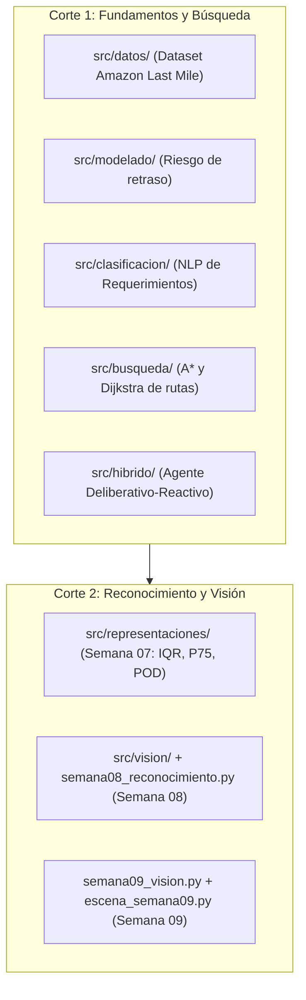
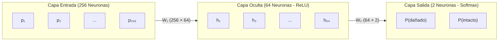
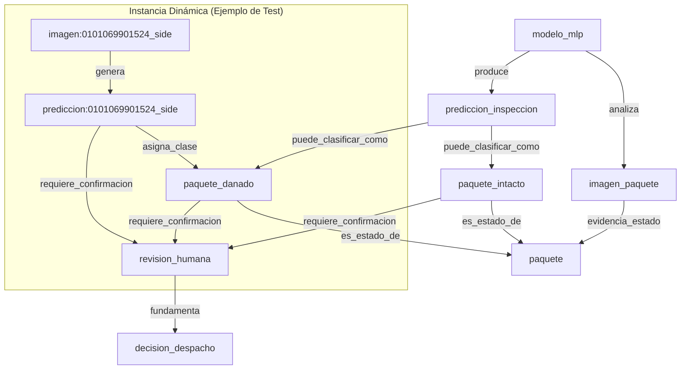

# Guía Integral de Estudio y Sustentación: Semana 08
## Reconocimiento Visual (MLP), Evidencia, Ontología y Persistencia en PostgreSQL

> **Proyecto:** IA Logística Amazon Last Mile — Detección, Reconocimiento y Visión Artificial  
> **Corte:** Corte 2 · Semana 08  
> **Ámbito de código:**  
> - Núcleo: `src/vision/` (`particion.py`, `modelo_mlp.py`, `ontologia.py`, `evidencia_mlp.py`) y `src/semana08_reconocimiento.py`  
> - Tubería de soporte: `src/vision/manifiesto.py`, `auditoria.py`, `almacenamiento.py`, `importacion.py`, `asociacion.py`  
> - Persistencia: PostgreSQL con Alembic (`migrations/versions/0003_...`, `0004_...`)  
> - API & Dashboard: `api/routers/modelo_visual.py` y `dashboard/src/views/MlpView.jsx`

---

## Tabla de Contenido

1. [El Mapa del Repositorio y Arquitectura de Archivos](#1-el-mapa-del-repositorio-y-arquitectura-de-archivos)
   - [1.1 ¿Por qué hay tantos archivos en `src/`? (Repositorio Acumulativo)](#11-por-qué-hay-tantos-archivos-en-src-repositorio-acumulativo)
   - [1.2 Los 5 Archivos Protagonistas de la Semana 08 y su Orden de Ejecución](#12-los-5-archivos-protagonistas-de-la-semana-08-y-su-orden-de-ejecución)
   - [1.3 Los Archivos de Soporte en `src/vision/` (Data Pipeline del Piloto)](#13-los-archivos-de-soporte-en-srcvision-data-pipeline-del-piloto)
2. [Conceptos Clave y Dudas Resueltas de Python](#2-conceptos-clave-y-dudas-resueltas-de-python)
   - [2.1 El Decorador `@property` (Propiedad Calculada / Lazy Getter)](#21-el-decorador-property-propiedad-calculada--lazy-getter)
   - [2.2 El Objeto `Ellipsis` (`...`) y Tipado de Tuplas Homogéneas](#22-el-objeto-ellipsis--y-tipado-de-tuplas-homogéneas)
   - [2.3 El Asterisco Solitario `*` (Argumentos Keyword-Only — PEP 3102)](#23-el-asterisco-solitario--argumentos-keyword-only--pep-3102)
   - [2.4 La Instrucción `raise` frente a `throw` en otros lenguajes](#24-la-instrucción-raise-frente-a-throw-en-otros-lenguajes)
   - [2.5 Inmutabilidad con `@dataclass(frozen=True)`](#25-inmutabilidad-con-dataclassfrozentrue)
3. [Entrada y Blindaje Metodológico: `src/vision/particion.py`](#3-entrada-y-blindaje-metodológico-srcvisionparticionpy)
   - [3.1 El Problema Logístico: Detección de Integridad (`intacto` vs `danado`)](#31-el-problema-logístico-detección-de-integridad-intacto-vs-danado)
   - [3.2 El Dataset del Piloto: 200 Imágenes Sintéticas Balanceadas](#32-el-dataset-del-piloto-200-imágenes-sintéticas-balanceadas)
   - [3.3 Blindaje contra *Data Leakage*: Estratificación por `grupo_origen`](#33-blindaje-contra-data-leakage-estratificación-por-grupo_origen)
   - [3.4 Vectorización Matemática: Reducción Lanczos a 16×16 y Normalización](#34-vectorización-matemática-reducción-lanczos-a-1616-y-normalización)
4. [La Red Neuronal Artificial: `src/vision/modelo_mlp.py`](#4-la-red-neuronal-artificial-srcvisionmodelo_mlppy)
   - [4.1 Arquitectura del Perceptrón Multicapa (`MLPClassifier`)](#41-arquitectura-del-perceptrón-multicapa-mlpclassifier)
   - [4.2 Conteo Exacto de Parámetros Entrenables (Pesos y Sesgos)](#42-conteo-exacto-de-parámetros-entrenables-pesos-y-sesgos)
   - [4.3 La Línea Base Mayoritaria (`DummyClassifier`)](#43-la-línea-base-mayoritaria-dummyclassifier)
   - [4.4 Desglose de Métricas: Accuracy, F1-Scores y Matriz de Confusión](#44-desglose-de-métricas-accuracy-f1-scores-y-matriz-de-confusión)
   - [4.5 Alerta de Convergencia (`ConvergenceWarning`) y Honestidad Científica](#45-alerta-de-convergencia-convergencewarning-y-honestidad-científica)
   - [4.6 ¿Por qué falló el modelo y qué nos enseña?](#46-por-qué-falló-el-modelo-y-qué-nos-enseña)
5. [Representación del Conocimiento y Ontología: `src/vision/ontologia.py`](#5-representación-del-conocimiento-y-ontología-srcvisionontologiapy)
   - [5.1 De la Probabilidad Numérica a la Gobernanza Semántica](#51-de-la-probabilidad-numérica-a-la-gobernanza-semántica)
   - [5.2 ¿Qué es GraphML y por qué se utiliza?](#52-qué-es-graphml-y-por-qué-se-utiliza)
   - [5.3 Las 10 Aristas Canónicas y las 3 Aristas Dinámicas de Instancia](#53-las-10-aristas-canónicas-y-las-3-aristas-dinámicas-de-instancia)
   - [5.4 Principio Ético Fundamental: *Human-in-the-Loop*](#54-principio-ético-fundamental-human-in-the-loop)
6. [Persistencia e Integridad Criptográfica: `src/vision/evidencia_mlp.py`](#6-persistencia-e-integridad-criptográfica-srcvisionevidencia_mlppy)
   - [6.1 ¿Por qué PostgreSQL y Alembic en vez del SQLite de la guía?](#61-por-qué-postgresql-y-alembic-en-vez-del-sqlite-de-la-guía)
   - [6.2 Esquema Relacional de Tablas](#62-esquema-relacional-de-tablas)
   - [6.3 Trazabilidad por Hashes SHA-256 e Idempotencia con `--registrar`](#63-trazabilidad-por-hashes-sha-256-e-idempotencia-con---registrar)
7. [Orquestación, API y Dashboard](#7-orquestación-api-y-dashboard)
   - [7.1 El CLI Principal: `src/semana08_reconocimiento.py`](#71-el-cli-principal-srcsemana08_reconocimientopy)
   - [7.2 Router FastAPI: `api/routers/modelo_visual.py`](#72-router-fastapi-apiroutersmodelo_visualpy)
   - [7.3 Interfaz de Usuario en React 19: `dashboard/src/views/MlpView.jsx`](#73-interfaz-de-usuario-en-react-19-dashboardsrcviewsmlpviewjsx)
8. [Simulador de Sustentación Oral (Preguntas de Examen y Defensas Modelo)](#8-simulador-de-sustentación-oral-preguntas-de-examen-y-defensas-modelo)

---

## 1. El Mapa del Repositorio y Arquitectura de Archivos

### 1.1 ¿Por qué hay tantos archivos en `src/`? (Repositorio Acumulativo)

El proyecto `ia-proyecto` no es un ejercicio aislado; es un **sistema acumulativo** que reúne todas las entregas del semestre universitario de Inteligencia Artificial:



Ningún archivo de `src/` está de más o es obsoleto:
* Si se eliminara `src/busqueda/`, la pestaña de rutas de la Semana 04 en el dashboard fallaría.
* Si se eliminara `src/representaciones/`, el laboratorio de la Semana 07 arrojaría error 404/500.
* Los 166 tests automatizados verifican la regresión completa de ambos cortes.

---

### 1.2 Los 5 Archivos Protagonistas de la Semana 08 y su Orden de Ejecución

Para estudiar o explicar la Semana 08, el foco debe ponerse estrictamente en esta tubería:

```
[1. particion.py] ──► [2. modelo_mlp.py] ──► [3. ontologia.py] ──► [4. evidencia_mlp.py]
                                     ▲
                                     │ (Orquestado por)
                       [5. semana08_reconocimiento.py]
```

1. **[`src/vision/particion.py`](file:///Users/jyarar/projects/u/x-semestre/ia-proyecto/src/vision/particion.py):**  
   Carga las 200 imágenes, las reduce a vectores Lanczos de 16×16 (256 intensidades normalizadas) y realiza la división 75/25 estratificada por grupos.
2. **[`src/vision/modelo_mlp.py`](file:///Users/jyarar/projects/u/x-semestre/ia-proyecto/src/vision/modelo_mlp.py):**  
   Configura el `MLPClassifier`, entrena con train, evalúa contra `DummyClassifier` en test y genera la matriz de confusión y el reporte de clasificación.
3. **[`src/vision/ontologia.py`](file:///Users/jyarar/projects/u/x-semestre/ia-proyecto/src/vision/ontologia.py):**  
   Toma la predicción, la conecta en el grafo NetworkX con las 10 relaciones de negocio y exporta el archivo `ontologia_logistica.graphml`.
4. **[`src/vision/evidencia_mlp.py`](file:///Users/jyarar/projects/u/x-semestre/ia-proyecto/src/vision/evidencia_mlp.py):**  
   Verifica los hashes SHA-256 del manifiesto y del `.pkl`, e inserta de forma inmutable e idempotente en PostgreSQL.
5. **[`src/semana08_reconocimiento.py`](file:///Users/jyarar/projects/u/x-semestre/ia-proyecto/src/semana08_reconocimiento.py):**  
   Punto de entrada de línea de comandos (CLI) que enlaza las 4 etapas con `--registrar`.

---

### 1.3 Los Archivos de Soporte en `src/vision/` (Data Pipeline del Piloto)

Dentro de `src/vision/` existen módulos complementarios creados para alimentar la base de datos antes del entrenamiento:

* **[`src/vision/manifiesto.py`](file:///Users/jyarar/projects/u/x-semestre/ia-proyecto/src/vision/manifiesto.py):** Contrato que lista las 200 imágenes del dataset (origen Kaggle: *Industrial Quality Control of Packages*), garantizando sus rutas y hashes.
* **[`src/vision/auditoria.py`](file:///Users/jyarar/projects/u/x-semestre/ia-proyecto/src/vision/auditoria.py):** Función `auditar_piloto()` que valida formato PNG, modo RGB, tamaño 960×540 y ausencia de archivos corruptos.
* **[`src/vision/almacenamiento.py`](file:///Users/jyarar/projects/u/x-semestre/ia-proyecto/src/vision/almacenamiento.py):** Gestor de acceso a disco en volumen privado para servir bytes de imágenes sin saturar la RAM.
* **[`src/vision/importacion.py`](file:///Users/jyarar/projects/u/x-semestre/ia-proyecto/src/vision/importacion.py) & `seed.py`:** Inserta las 200 muestras iniciales en la tabla `imagenes` de PostgreSQL.
* **[`src/vision/asociacion.py`](file:///Users/jyarar/projects/u/x-semestre/ia-proyecto/src/vision/asociacion.py):** Asocia de forma simulada cada imagen de paquete a una parada del dataset de Amazon Last Mile para visualización en el dashboard.

---

## 2. Conceptos Clave y Dudas Resueltas de Python

### 2.1 El Decorador `@property` (Propiedad Calculada / Lazy Getter)

En [`src/vision/particion.py`](file:///Users/jyarar/projects/u/x-semestre/ia-proyecto/src/vision/particion.py#L49-L63):

```python
@property
def X_train(self) -> np.ndarray:
    return np.stack([self.muestras[i].vector for i in self.indices_train])
```

#### ¿Qué hace?
Convierte un método en un **atributo virtual de solo lectura**. Se accede **sin paréntesis `()`**:
```python
# Se escribe:
datos = particion.X_train

# En vez de:
datos = particion.X_train()
```

#### Comparativa con otros lenguajes:
* **Python:** `@property` sobre el método.
* **JavaScript / TypeScript:** `get xTrain() { return ...; }`
* **C#:** `public np.ndarray XTrain => ...;`
* **Java:** `public np.ndarray getXTrain() { return ...; }` *(Java obliga a usar paréntesis)*.

#### ¿Por qué lo usamos aquí?
1. **Evaluación Perezosa (*Lazy Evaluation*):** No duplica matrices de 150 filas × 256 columnas en memoria RAM; la matriz NumPy se calcula al vuelo en el milisegundo exacto en que el modelo la pide.
2. **Inmutabilidad de Seguridad:** Como no existe un `@X_train.setter`, si alguien intenta `particion.X_train = nueva_matriz`, Python arroja inmediatamente `AttributeError: property 'X_train' has no setter`. Nadie puede corromper los datos de entrenamiento.
3. **Compatibilidad Estándar:** Respeta la sintaxis idiomática de scikit-learn: `modelo.fit(particion.X_train, particion.y_train)`.

---

### 2.2 El Objeto `Ellipsis` (`...`) y Tipado de Tuplas Homogéneas

En la firma de `ParticionVisual`:
```python
muestras: tuple[MuestraVisual, ...]
```

Los tres puntos (`...`) corresponden formalmente al objeto singleton built-in de Python **`Ellipsis`**:
* `tuple[str, int]`: Modela una tupla de **longitud fija de exactamente 2 elementos** heterogéneos (un string y un entero).
* `tuple[MuestraVisual, ...]`: Indica una tupla de **longitud variable arbitraria** (pueden ser 0, 50, 200 o miles de elementos) donde **todos** son estrictamente del tipo `MuestraVisual`.

---

### 2.3 El Asterisco Solitario `*` (Argumentos Keyword-Only — PEP 3102)

En la firma de [`separar_grupos()`](file:///Users/jyarar/projects/u/x-semestre/ia-proyecto/src/vision/particion.py#L84):

```python
def separar_grupos(
    muestras: tuple[MuestraVisual, ...], *, semilla: int = SEMILLA_PARTICION,
    fraccion_prueba: float = 0.25,
) -> tuple[tuple[int, ...], tuple[int, ...]]:
```

#### ¿Qué significa el `*` suelto?
El asterisco actúa como una **frontera obligatoria**:
* A la izquierda del `*`: Parámetros posicionales normales (`muestras`).
* A la derecha del `*`: **Parámetros obligatoriamente nombrados (*Keyword-Only Arguments*)**.

```python
# ❌ INVÁLIDO (Python lanza TypeError):
separar_grupos(mis_muestras, 42, 0.25)

# ✅ VÁLIDO Y OBLIGATORIO:
separar_grupos(mis_muestras, semilla=42, fraccion_prueba=0.25)
```

#### Justificación de Ingeniería:
Evita confusiones catastróficas de orden. En llamadas con números como `42` y `0.25`, un programador podría invertir los valores por error. El `*` fuerza a que el código sea autoexplicativo y seguro.

---

### 2.4 La Instrucción `raise` frente a `throw` en otros lenguajes

**`raise`** es la palabra reservada en Python para **lanzar / disparar una excepción**. Es el análogo directo de `throw`:

| Lenguaje | Instrucción de disparo |
| :--- | :--- |
| **Python** | `raise ValueError("Mensaje")` |
| **JavaScript / TypeScript** | `throw new Error("Mensaje");` |
| **Java / C#** | `throw new IllegalArgumentException("Mensaje");` |

#### Comportamiento:
Detiene inmediatamente el flujo de la función y escala el error en la pila de llamadas hasta encontrar un bloque `try...except`. En Semana 8 usamos:
* `raise ValueError(...)`: Para errores de tipos o argumentos numéricos fuera de rango.
* `raise ErrorVisual(...)`: Excepción personalizada del proyecto para violaciones de integridad del piloto visual.

---

### 2.5 Inmutabilidad con `@dataclass(frozen=True)`

Tanto `MuestraVisual` como `ParticionVisual` están decoradas con `@dataclass(frozen=True)`.  
Cualquier intento de mutar un campo tras la instanciación (`muestra.etiqueta = "otra"`) lanza `FrozenInstanceError`. Combinado con tuplas internas inmutables, garantiza que el dataset permanezca blindado durante todo el ciclo de vida de la aplicación.

---

## 3. Entrada y Blindaje Metodológico: `src/vision/particion.py`

### 3.1 El Problema Logístico: Detección de Integridad (`intacto` vs `danado`)

En centros de distribución de última milla, los paquetes circulan por cintas transportadoras hacia las bahías de carga. Cargar un paquete con la caja rota, aplastada o abierta genera sobrecostos operativos, reclamos de clientes y devoluciones. El objetivo del módulo visual es explorar si un clasificador ligero puede prefiltrar anomalías físicas.

### 3.2 El Dataset del Piloto: 200 Imágenes Sintéticas Balanceadas

* **Total de imágenes:** 200 archivos PNG.
* **Balance exacto:** 100 imágenes etiquetadas como `danado` y 100 como `intacto`.
* **Vista:** `side` (perspectiva lateral uniforme).
* **Naturaleza:** Piloto sintético renderizado controlado; no son fotos de envíos reales de Amazon (se declara explícitamente en reportes y UI).

---

### 3.3 Blindaje contra *Data Leakage*: Estratificación por `grupo_origen`

> [!IMPORTANT]
> **Pregunta de examen:** *¿Por qué no usar simplemente `train_test_split(X, y)`?*

En visión por computadora, si múltiples imágenes corresponden a un mismo objeto físico fotografiado bajo leves cambios de rotación o luz, mezclar las imágenes individuales causaría **fuga de información (*Data Leakage*)**. La red memorizaría el fondo o el brillo específico del grupo y parecería tener un accuracy del 95%, pero fallaría estrepitosamente en el mundo real.

```
                    [ 200 Imágenes / Múltiples Grupos ]
                                     │
             ┌───────────────────────┴───────────────────────┐
             ▼                                               ▼
   Train: 150 imágenes (75%)                       Test: 50 imágenes (25%)
   (Grupos asignados a Train)                      (Grupos asignados a Test)
   75 dañados / 75 intactos                        25 dañados / 25 intactos
             │                                               │
             ▼                                               ▼
  Ajuste de Pesos Sinápticos                      Evaluación Única Reservada
  (Backpropagation + Adam)                        (Generalización Genuina)
```

En [`separar_grupos()`](file:///Users/jyarar/projects/u/x-semestre/ia-proyecto/src/vision/particion.py#L84-L115):
1. Se identifican los grupos únicos (`muestra.grupo_origen`).
2. Se realiza la estratificación **a nivel de grupo**.
3. Se garantiza que **ningún grupo de entrenamiento aparezca en el conjunto de prueba**.
4. Semilla fija: `SEMILLA_PARTICION = 20260925`.

---

### 3.4 Vectorización Matemática: Reducción Lanczos a 16×16 y Normalización

La función [`vectorizar_png()`](file:///Users/jyarar/projects/u/x-semestre/ia-proyecto/src/vision/particion.py#L72-L82) transforma la matriz de imagen en el vector de características de entrada:

1. **Conversión a Escala de Grises (`L`):**
   Descarta la crominancia y preserva la intensidad luminosa (luminancia):
   $$I_{\text{gris}} = 0,299 R + 0,587 G + 0,114 B$$
2. **Remuestreo de Lanczos a $16 \times 16$ píxeles:**
   El filtro sinc de Lanczos aplica convolución con una ventana basada en la función $\text{sinc}(x) = \frac{\sin(\pi x)}{\pi x}$. A diferencia de la interpolación bilineal que difumina bordes, Lanczos preserva discontinuidades y bordes agudos de roturas.
3. **Aplanado (*Flatten*) y Normalización Lineal a $[0, 1]$:**
   $$\vec{x} = \left[ \frac{p_1}{255.0}, \, \frac{p_2}{255.0}, \, \dots, \, \frac{p_{256}}{255.0} \right] \in \mathbb{R}^{256}$$
   Evita valores gigantes de entrada que saturen los gradientes en el entrenamiento.

---

## 4. La Red Neuronal Artificial: `src/vision/modelo_mlp.py`

### 4.1 Arquitectura del Perceptrón Multicapa (`MLPClassifier`)

Configuración en código:
```python
PARAMETROS_MLP = {
    "hidden_layer_sizes": (64,),
    "max_iter": 400,
    "random_state": 42
}
```



* **Función de activación oculta:** **ReLU** ($f(z) = \max(0, z)$), rápida y libre de desvanecimiento de gradiente para $z > 0$.
* **Función de activación de salida:** **Softmax**, que convierte logits en una distribución válida de probabilidad ($P_1 + P_2 = 1.0$).
* **Optimizador:** **Adam** (estimación adaptativa de momentos).

---

### 4.2 Conteo Exacto de Parámetros Entrenables (Pesos y Sesgos)

Para calcular la capacidad matemática del modelo:

$$\text{Capa Oculta: } W_1 = 256 \times 64 = 16.384 \text{ pesos}, \quad b_1 = 64 \text{ sesgos} \implies 16.448$$
$$\text{Capa Salida: } W_2 = 64 \times 2 = 128 \text{ pesos}, \quad b_2 = 2 \text{ sesgos} \implies 130$$
$$\textbf{Total de Parámetros Entrenables} = 16.448 + 130 = \mathbf{16.578 \text{ parámetros}}$$

---

### 4.3 La Línea Base Mayoritaria (`DummyClassifier`)

En `modelo_mlp.py`:
```python
baseline = DummyClassifier(strategy="most_frequent")
baseline.fit(X_train, y_train)
```
En ciencia de datos, **un accuracy no tiene sentido sin una línea base (*baseline*)**. Como el conjunto de prueba tiene 25 paquetes dañados y 25 intactos, predecir ciegamente la clase mayoritaria da exactamente:
$$\text{Accuracy Línea Base} = \frac{25}{50} = \mathbf{0,500 \ (50,0\%)}$$

---

### 4.4 Desglose de Métricas: Accuracy, F1-Scores y Matriz de Confusión

Al evaluar sobre las 50 imágenes reservadas de prueba:

| Métrica | MLP Entrenado | Línea Base (Dummy) |
| :--- | :---: | :---: |
| **Accuracy Global** | **0,480 (48,0%)** | **0,500 (50,0%)** |
| **F1-Score (Dañado)** | 0,500 | 0,000 / 0,667 |
| **F1-Score (Intacto)** | 0,458 | 0,000 / 0,667 |

#### Matriz de Confusión ($N=50$):
$$\begin{array}{c|cc}
\text{Real} \backslash \text{Predicha} & \textbf{Dañado} & \textbf{Intacto} \\
\hline
\textbf{Dañado (25)} & \mathbf{13} \text{ (VP)} & \mathbf{12} \text{ (FN)} \\
\textbf{Intacto (25)} & \mathbf{14} \text{ (FP)} & \mathbf{11} \text{ (VN)}
\end{array}$$

* **Verdaderos Positivos (VP = 13):** Paquetes rotos detectados como rotos.
* **Falsos Negativos (FN = 12):** Paquetes rotos clasificados como sanos (peligro operativo).
* **Falsos Positivos (FP = 14):** Paquetes sanos clasificados como rotos (falsa alarma).
* **Verdaderos Negativos (VN = 11):** Paquetes sanos clasificados como sanos.

---

### 4.5 Alerta de Convergencia (`ConvergenceWarning`) y Honestidad Científica

Durante el entrenamiento en scikit-learn, se disparó la advertencia:
```
ConvergenceWarning: Stochastic Optimizer: Maximum iterations (400) reached and the optimization hasn't converged yet.
```
* **Qué significa:** Tras 400 épocas de backpropagation, la superficie de pérdida (*loss surface*) no alcanzó un mínimo local estable; el gradiente seguía oscilando.
* **Captura en metadatos:** En [`modelo_mlp.py`](file:///Users/jyarar/projects/u/x-semestre/ia-proyecto/src/vision/modelo_mlp.py#L40-L42), el código intercepta la advertencia con `warnings.catch_warnings` y la registra formalmente en el JSON: `"convergencia_advertida": true`.

---

### 4.6 ¿Por qué falló el modelo y qué nos enseña?

El accuracy del 48% queda por debajo del 50% del azar. Las causas técnicas son:

1. **Resolución Espacial Insuficiente (16×16 px):**  
   Una rasgadura física de 5 mm se convierte en un solo píxel borroso al reducir una imagen de 960×540 a 16×16. La señal se pierde en el remuestreo.
2. **Volumen de Datos Reducido:**  
   150 imágenes de entrenamiento son insuficientes para ajustar 16.578 pesos sin caer en sobreajuste o confusión.
3. **Limitación Estructural del MLP frente a las CNN:**  
   Un MLP aplana la matriz a un vector 1D; trata cada píxel como independiente y pierde la correlación de vecindad bidimensional (*invarianza traslacional*). Una rotura en la esquina izquierda no activa los mismos pesos que una rotura en el centro.

> [!TIP]
> **Lección de Sustentación:** Presentar el 48% con transparencia demuestra madurez profesional. Un mal ingeniero inventa métricas o fuerza sobreajuste para mostrar "99%". Un buen ingeniero concluye formalmente: **el experimento demuestra que este modelo no es apto para producción y no debe autorizar despachos sin supervisión humana.**

---

## 5. Representación del Conocimiento y Ontología: `src/vision/ontologia.py`

### 5.1 De la Probabilidad Numérica a la Gobernanza Semántica

Un modelo de Deep Learning o Machine Learning solo entrega un número flotante (ej. $P(\text{danado}) = 0,58$). Las aplicaciones empresariales no pueden operar sobre flotantes huérfanos. Se requiere un **grafo ontológico** que estructure el significado, las entidades del dominio y las restricciones legales de la operación.

---

### 5.2 ¿Qué es GraphML y por qué se utiliza?

**GraphML (Graph Markup Language)** es un formato de archivo estándar internacional basado en **XML** diseñado específicamente para describir, almacenar e intercambiar estructuras de **grafos y redes** (nodos, aristas dirigidas/no dirigidas, pesos, jerarquías y atributos personalizados).

Fue desarrollado por un consorcio de investigadores y herramientas de teoría de grafos para resolver un problema crítico: **la falta de un formato universal interoperable para grafos**.

#### A. ¿Por qué GraphML y no un simple JSON o CSV?

| Característica | Archivo CSV | Archivo JSON estándar | Archivo GraphML (`.graphml`) |
| :--- | :--- | :--- | :--- |
| **Estructura nativa** | Solo tablas planas bidimensionales (filas y columnas). | Árboles anidados clave-valor; no tiene concepto formal de arista ni nodo. | **Topología de red nativa** (`<node>`, `<edge>`, `<graph>`). |
| **Tipado de atributos** | Ninguno (todo es texto plano hasta que alguien lo castea). | Débil y dependiente del parser; no hay esquema formal estricto. | **Estricto y validado por esquema XSD** (`<key attr.type="string">`). |
| **Interoperabilidad** | Cada desarrollador inventa sus columnas (`origen`, `destino`, `peso`). | Cada app inventa su formato (`nodes: []`, `links: []`, `edges: []`). | **Estándar universal**: se abre directamente en herramientas de visualización científica como **Gephi, Cytoscape, yEd Graph Editor, Neo4j, igraph y NetworkX** sin programar convertidores. |
| **Direccionalidad** | Implícita o no estandarizada. | Implícita. | **Explícita en el encabezado**: `<graph edgedefault="directed">`. |

---

#### B. La Estructura XML Real de Nuestro Proyecto

Cuando el script [`src/vision/ontologia.py`](file:///Users/jyarar/projects/u/x-semestre/ia-proyecto/src/vision/ontologia.py) exporta a [`artifacts/semana08/ontologia_logistica.graphml`](file:///Users/jyarar/projects/u/x-semestre/ia-proyecto/artifacts/semana08/ontologia_logistica.graphml), se genera este XML formal:

```xml
<?xml version='1.0' encoding='utf-8'?>
<graphml xmlns="http://graphml.graphdrawing.org/xmlns" 
         xmlns:xsi="http://www.w3.org/2001/XMLSchema-instance" 
         xsi:schemaLocation="http://graphml.graphdrawing.org/xmlns 
         http://graphml.graphdrawing.org/xmlns/1.0/graphml.xsd">
  
  <!-- 1. DEFINICIÓN DE ATRIBUTOS TIPADOS -->
  <key id="d0" for="graph" attr.name="version" attr.type="string" />
  <key id="d1" for="edge" attr.name="rel" attr.type="string" />

  <!-- 2. DECLARACIÓN DEL GRAFO DIRIGIDO -->
  <graph edgedefault="directed">
    
    <!-- 3. DECLARACIÓN DE NODOS (ENTIDADES DEL DOMINIO) -->
    <node id="imagen_paquete" />
    <node id="paquete" />
    <node id="modelo_mlp" />
    <node id="prediccion_inspeccion" />
    <node id="paquete_intacto" />
    <node id="paquete_danado" />
    <node id="revision_humana" />
    <node id="decision_despacho" />

    <!-- 4. DECLARACIÓN DE ARISTAS (RELACIONES SEMÁNTICAS CON DATA ATRIBUTADA) -->
    <edge source="modelo_mlp" target="imagen_paquete">
      <data key="d1">analiza</data>
    </edge>
    <edge source="modelo_mlp" target="prediccion_inspeccion">
      <data key="d1">produce</data>
    </edge>
    <edge source="paquete_danado" target="revision_humana">
      <data key="d1">requiere_confirmacion</data>
    </edge>
    <edge source="revision_humana" target="decision_despacho">
      <data key="d1">fundamenta</data>
    </edge>
    
    <data key="d0">ontologia-logistica-v1</data>
  </graph>
</graphml>
```

---

#### C. ¿Cómo se Genera y Valida en Python? (Líneas 39 a 45 de `ontologia.py`)

NetworkX implementa soporte nativo para GraphML. Pero fíjate en el detalle de **auditoría de software defensivo** que colocamos en el código:

```python
def exportar_graphml(grafo: nx.DiGraph, destino: Path) -> None:
    """Exporta el grafo final, incluida la predicción concreta; nunca antes."""
    destino.parent.mkdir(parents=True, exist_ok=True)
    nx.write_graphml(grafo, destino)
    
    # Verificación de integridad bidireccional (Round-Trip Test):
    cargado = nx.read_graphml(destino)
    if set(cargado.edges(data="rel")) != set(grafo.edges(data="rel")):
        raise RuntimeError("GraphML no conservó todas las relaciones.")
```
1. `nx.write_graphml()` serializa la estructura del grafo de NetworkX a XML GraphML en disco.
2. Inmediatamente después, `nx.read_graphml()` vuelve a leer el archivo XML generado.
3. Se comprueba que el conjunto de relaciones leídas sea **exactamente idéntico al que estaba en memoria**. Si algún atributo se corrompió o se perdió en la serialización XML, el sistema arroja una excepción y no permite dar por válida la evidencia.

---

#### D. Estructura Visual del Grafo y sus Conexiones

En [`src/vision/ontologia.py`](file:///Users/jyarar/projects/u/x-semestre/ia-proyecto/src/vision/ontologia.py), se modela este grafo dirigido:



---

### 5.3 Las 10 Aristas Canónicas y las 3 Aristas Dinámicas de Instancia

#### A. Las 10 Aristas Estáticas de Dominio:
1. `(modelo_mlp, analiza, imagen_paquete)`
2. `(modelo_mlp, produce, prediccion_inspeccion)`
3. `(imagen_paquete, evidencia_estado, paquete)`
4. `(prediccion_inspeccion, puede_clasificar_como, paquete_intacto)`
5. `(prediccion_inspeccion, puede_clasificar_como, paquete_danado)`
6. `(paquete_intacto, es_estado_de, paquete)`
7. `(paquete_danado, es_estado_de, paquete)`
8. `(paquete_intacto, requiere_confirmacion, revision_humana)`
9. `(paquete_danado, requiere_confirmacion, revision_humana)`
10. `(revision_humana, fundamenta, decision_despacho)`

#### B. Las 3 Aristas Dinámicas de Instancia (Total = 13 aristas):
Cuando el sistema evalúa una muestra reservada concreta:
11. `(imagen:{id_origen}, genera, prediccion:{id_origen})`
12. `(prediccion:{id_origen}, asigna_clase, paquete_{clase})`
13. `(prediccion:{id_origen}, requiere_confirmacion, revision_humana)`

---

### 5.4 Principio Ético Fundamental: *Human-in-the-Loop*

> [!IMPORTANT]
> Nótese que **no existe ninguna arista directa** entre `prediccion_inspeccion` y `decision_despacho`.
> * La red neuronal no tiene la autoridad de aprobar ni detener un envío.
> * Toda predicción está forzada ontológicamente a pasar por `revision_humana`.
> * La IA actúa como sistema de soporte y recomendación, pero la responsabilidad legal del despacho recae exclusivamente en el operador humano.

---

## 6. Persistencia e Integridad Criptográfica: `src/vision/evidencia_mlp.py`

### 6.1 ¿Por qué PostgreSQL y Alembic en vez del SQLite de la guía?

La guía académica sugería un archivo SQLite suelto. En el proyecto se justificó la adopción de PostgreSQL:
* **Concurrencia:** SQLite bloquea el archivo ante escrituras (`table locked`), impidiendo que múltiples clientes de FastAPI lean y escriban simultáneamente.
* **Control de Esquema:** Alembic proporciona migraciones transaccionales versionadas y auditables (`0003_piloto_visual` y `0004_mlp_visual`).
* **Única fuente de verdad:** Los datos de rutas de Amazon y los registros de visión residen en la misma infraestructura relacional.

---

### 6.2 Esquema Relacional de Tablas

```
   ┌───────────────────────┐
   │        dataset        │
   ├───────────────────────┤
   │ id (PK)               │
   │ sha256 (Hash global)  │
   └──────────┬────────────┘
              │ 1:N
   ┌──────────┴────────────┐            1:N            ┌───────────────────────────────┐
   │       imagenes        │◄──────────────────────────┤     muestras_modelo_visual    │
   ├───────────────────────┤                           ├───────────────────────────────┤
   │ id (PK)               │                           │ id (PK)                       │
   │ dataset_id (FK)       │                           │ modelo_id (FK) ───────────────┼───┐
   │ id_origen             │                           │ imagen_id (FK)                │   │
   │ grupo_origen          │                           │ split ('train' | 'test')      │   │
   │ etiqueta              │                           │ clase_predicha                │   │
   │ sha256                │                           │ probabilidad                  │   │
   │ ruta_relativa         │                           └───────────────────────────────┘   │
   └───────────────────────┘                                                               │
                                                       ┌───────────────────────────────┐   │
                                                       │        modelos_visuales       │   │
                                                       ├───────────────────────────────┤   │
                                                       │ id (PK) ◄─────────────────────┘
                                                       │ version ('mlp-visual-v1')     │
                                                       │ manifiesto_sha256             │
                                                       │ artefacto_sha256 (.pkl)       │
                                                       │ metadatos_json                │
                                                       └───────────────────────────────┘
```

---

### 6.3 Trazabilidad por Hashes SHA-256 e Idempotencia con `--registrar`

En [`src/vision/evidencia_mlp.py`](file:///Users/jyarar/projects/u/x-semestre/ia-proyecto/src/vision/evidencia_mlp.py):
1. **Validación Criptográfica Cruzada:**  
   Se verifica `sha256(dataset_manifiesto)` contra la base de datos y `sha256(modelo_mlp_logistica.pkl)` contra los metadatos. Si un solo byte fue alterado, se aborta la transacción con `ErrorVisual`.
2. **Inmutabilidad de Ground Truth:**  
   Las etiquetas reales de la tabla `imagenes` **nunca se tocan ni sobreescriben**. La predicción del modelo se guarda en la tabla hija `muestras_modelo_visual`.
3. **Idempotencia Estricta:**  
   Si se ejecuta `python -m src.semana08_reconocimiento --registrar` múltiples veces, el sistema detecta que el registro idéntico ya existe y retorna `(existente, False)` sin duplicar filas ni lanzar excepciones.

---

## 7. Orquestación, API y Dashboard

### 7.1 El CLI Principal: `src/semana08_reconocimiento.py`

Es el script orquestador ejecutable desde la consola:
```bash
python -m src.semana08_reconocimiento --registrar
```
1. Invoca `preparar_piloto()` para leer y vectorizar imágenes.
2. Invoca `entrenar_y_evaluar()` para entrenar el MLP y calcular métricas.
3. Invoca `guardar_resultado()` para emitir el `.pkl` y el `.json`.
4. Invoca `construir_ontologia()` y exporta el `.graphml`.
5. Si recibe `--registrar`, abre sesión SQLAlchemy y sella la evidencia en PostgreSQL.

---

### 7.2 Router FastAPI: `api/routers/modelo_visual.py`

Expone tres endpoints REST optimizados:
* `GET /api/modelo-visual/resumen`: Devuelve `EstadoModelo` con el accuracy (48%), línea base (50%), matriz de confusión y aviso de convergencia.
* `GET /api/modelo-visual/predicciones`: Devuelve páginas de predicciones reservadas del conjunto de prueba con sus probabilidades y la URL del archivo de imagen.
* `GET /api/modelo-visual/ontologia`: Devuelve las relaciones del grafo para renderizar el diagrama semántico en el cliente.

---

### 7.3 Interfaz de Usuario en React 19: `dashboard/src/views/MlpView.jsx`

Ubicada en **Corte 2** dentro de la barra lateral de Órbita:
* **Tarjeta de Estado:** Muestra visualmente las métricas frente a la línea base y la matriz de confusión interactiva.
* **Explorador de Muestras Reservadas:** Permite seleccionar paquetes del conjunto de prueba para ver la imagen, la predicción de la red y la probabilidad asociada.
* **Grafo Semántico:** Muestra el diagrama de la ontología destacando el paquete evaluado y la estación de confirmación humana obligatoria.

---

## 8. Simulador de Sustentación Oral (Preguntas de Examen y Defensas Modelo)

### ❓ Pregunta 1: *"¿Por qué obtuvieron un 48% de accuracy en el MLP? ¿No es un resultado deficiente?"*
> **Tu defensa:**  
> *"Desde el punto de vista del rendimiento del clasificador, el modelo efectivamente no supera el azar, ya que la línea base mayoritaria es del 50%. Sin embargo, desde el punto de vista metodológico y de ingeniería, es un resultado riguroso y transparente. Al reducir imágenes a 16×16 píxeles con Lanczos, se pierde la resolución espacial necesaria para detectar fisuras sutiles, y un MLP carece de invarianza traslacional. Forzar un 90% habría requerido memorizar los datos (overfitting) o cometer fuga de información. Este 48% sustenta de forma irrebatible nuestra conclusión de diseño: el modelo no puede automatizar despachos y exige un protocolo Human-in-the-Loop."*

---

### ❓ Pregunta 2: *"¿Por qué separaron por grupos (`grupo_origen`) y no con un `train_test_split` estándar?"*
> **Tu defensa:**  
> *"Para prevenir el Group Data Leakage. El dataset contiene imágenes que comparten ángulos o sesiones de origen. Si se mezclaran individualmente al azar, imágenes con la misma iluminación o fondo caerían en train y test simultáneamente; el modelo memorizaría el fondo y parecería acertar sin haber aprendido el defecto. Al particionar a nivel de grupo, garantizamos que el conjunto de prueba contenga objetos completamente inéditos para la red."*

---

### ❓ Pregunta 3: *"¿Qué utilidad tiene la ontología GraphML si ya tenían la probabilidad de salida del MLP?"*
> **Tu defensa:**  
> *"La probabilidad es solo un número flotante desprovisto de contexto normativo. La ontología formaliza la gobernanza del sistema: define qué significa la predicción y qué entidades involucra. En nuestro diseño, la ontología prohíbe que el modelo autorice un despacho; tanto para paquetes dañados como intactos, la arista apunta obligatoriamente hacia `revision_humana`, y solo esta fundamenta la `decision_despacho`. La ontología formaliza la ética y la seguridad operativa del sistema."*

---

### ❓ Pregunta 4: *"¿Por qué usaron PostgreSQL y no SQLite como proponía la guía de clase?"*
> **Tu defensa:**  
> *"Porque SQLite bloquea el archivo ante accesos concurrentes de lectura y escritura, lo que no escala en una arquitectura con FastAPI y múltiples usuarios en el dashboard. Además, PostgreSQL nos permite controlar las migraciones de base de datos de manera profesional mediante Alembic (`0003` y `0004`), manteniendo un esquema relacional tipado, transaccional y consistente con los datos logísticos de Amazon."*

---

### ❓ Pregunta 5: *"¿Cómo garantizan que nadie alteró el modelo `.pkl` o los datos después de entrenar?"*
> **Tu defensa:**  
> *"Mediante verificación criptográfica cruzada con SHA-256 en el módulo `evidencia_mlp.py`. Antes de registrar en PostgreSQL, se calcula el hash del manifiesto del dataset y el hash del binario del modelo serializado `.pkl`. Ambos hashes quedan sellados en la base de datos. Si un solo byte cambia en disco, el sistema detecta la discrepancia y rechaza la ejecución con un `ErrorVisual`."*
