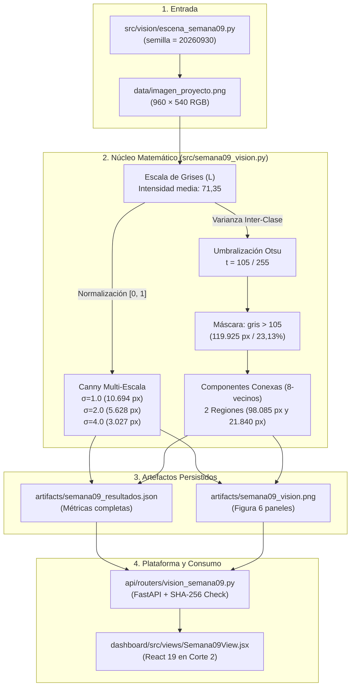
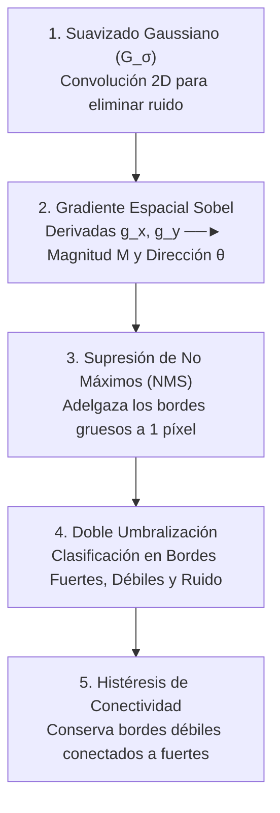
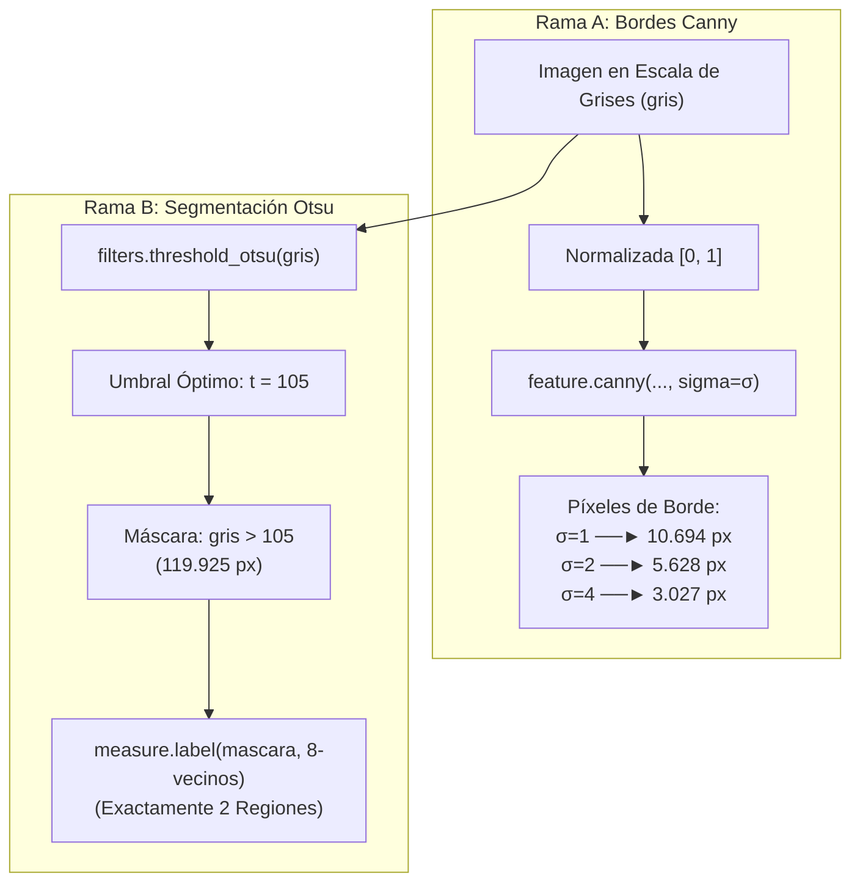

# Guía Integral de Estudio y Sustentación: Semana 09
## Características, Contornos con Canny, Umbralización Otsu y Segmentación Conexa

> **Proyecto:** IA Logística Amazon Last Mile — Detección, Reconocimiento y Visión Artificial  
> **Corte:** Corte 2 · Semana 09  
> **Ámbito de código:**  
> - Generación de entrada: `src/vision/escena_semana09.py` (`data/imagen_proyecto.png`)  
> - Procesamiento y CLI: `src/semana09_vision.py`  
> - Artefactos producidos: `artifacts/semana09_vision.png` y `artifacts/semana09_resultados.json`  
> - API & Integridad: `api/routers/vision_semana09.py` (FastAPI con validación SHA-256)  
> - Dashboard: `dashboard/src/views/Semana09View.jsx` (React 19 en Corte 2 de Órbita)  
> - Pruebas: `tests/test_semana09_vision.py`

---

## Tabla de Contenido

1. [Auditoría de Rúbrica: ¿Está Completa la Semana 09?](#1-auditoría-de-rúbrica-está-completa-la-semana-09)
   - [1.1 Tabla de Correspondencia: Exigencia de Clase vs Implementación Real](#11-tabla-de-correspondencia-exigencia-de-clase-vs-implementación-real)
   - [1.2 Diferencias y Mejoras frente al Enunciado de Monedas (`data.coins()`)](#12-diferencias-y-mejoras-frente-al-enunciado-de-monedas-datacoins)
2. [Arquitectura de Archivos y Flujo de Procesamiento](#2-arquitectura-de-archivos-y-flujo-de-procesamiento)
   - [2.1 El Pipeline Lineal Desacoplado](#21-el-pipeline-lineal-desacoplado)
   - [2.2 Los 4 Archivos Involucrados](#22-los-4-archivos-involucrados)
3. [La Escena Logística Sintética Propia: `escena_semana09.py`](#3-la-escena-logística-sintética-propia-escena_semana09py)
   - [3.1 ¿Por qué crear una escena con código y semilla fija?](#31-por-qué-crear-una-escena-con-código-y-semilla-fija)
   - [3.2 Elementos Geométricos y Retos Morfológicos Diseñados](#32-elementos-geométricos-y-retos-morfológicos-diseñados)
4. [Extracción de Características Globales de Imagen](#4-extracción-de-características-globales-de-imagen)
   - [4.1 Conversión de RGB a Escala de Grises y Rango $[0, 255]$](#41-conversión-de-rgb-a-escala-de-grises-y-rango-0-255)
   - [4.2 Intensidad Luminosa: Media, Desviación Estándar y Bimodalidad](#42-intensidad-luminosa-media-desviación-estándar-y-bimodalidad)
   - [4.3 Color Medio RGB y Texturas de Alta Frecuencia](#43-color-medio-rgb-y-texturas-de-alta-frecuencia)
5. [Detección de Bordes Canny: Fundamento Teórico y Algoritmo](#5-detección-de-bordes-canny-fundamento-teórico-y-algoritmo)
   - [5.1 El Algoritmo Óptimo de John Canny (Las 5 Etapas Matemáticas)](#51-el-algoritmo-óptimo-de-john-canny-las-5-etapas-matemáticas)
   - [5.2 Sensibilidad del Parámetro $\sigma$ (1.0 vs 2.0 vs 4.0) con Datos Reales](#52-sensibilidad-del-parámetro-sigma-10-vs-20-vs-40-con-datos-reales)
   - [5.3 Trade-off de Ingeniería: Sobredetalle vs Pérdida de Información](#53-trade-off-de-ingeniería-sobredetalle-vs-pérdida-de-información)
6. [Umbralización Global Automática de Otsu](#6-umbralización-global-automática-de-otsu)
   - [6.1 Derivación Matemática: Maximización de la Varianza Inter-Clase ($\sigma_b^2$)](#61-derivación-matemática-maximización-de-la-varianza-inter-clase-sigma_b2)
   - [6.2 Resultado Numérico: El Umbral Óptimo $t = 105 / 255$](#62-resultado-numérico-el-umbral-óptimo-t--105--255)
   - [6.3 La Máscara Binaria Booleana y su Superficie](#63-la-máscara-binaria-booleana-y-su-superficie)
7. [Segmentación por Componentes Conexas (Etiquetado 8-Vecinos)](#7-segmentación-por-componentes-conexas-etiquetado-8-vecinos)
   - [7.1 ¿Por qué 8-Conectividad (`connectivity=2`) y no 4-Conectividad?](#71-por-qué-8-conectividad-connectivity2-y-no-4-conectividad)
   - [7.2 Análisis de las 2 Regiones Conectadas y sus Áreas en Píxeles](#72-análisis-de-las-2-regiones-conectadas-y-sus-áreas-en-píxeles)
8. [Las Dos Grandes Trampas de Sustentación Oral](#8-las-dos-grandes-trampas-de-sustentación-oral)
   - [8.1 Trampa 1: «¿2 Regiones Conectadas = 2 Paquetes en la Banda?»](#81-trampa-1-2-regiones-conectadas--2-paquetes-en-la-banda)
   - [8.2 Trampa 2: «¿Por qué variar $\sigma$ en Canny NO altera Otsu ni las Regiones?»](#82-trampa-2-por-qué-variar-sigma-en-canny-no-altera-otsu-ni-las-regiones)
9. [Arquitectura de Software, API y Dashboard](#9-arquitectura-de-software-api-y-dashboard)
   - [9.1 Patrón de Cómputo Offline y Publicación Inmutable](#91-patrón-de-cómputo-offline-y-publicación-inmutable)
   - [9.2 Control Criptográfico SHA-256 y Protección `HTTP 503`](#92-control-criptográfico-sha-256-y-protección-http-503)
   - [9.3 Interfaz en React 19: `dashboard/src/views/Semana09View.jsx`](#93-interfaz-en-react-19-dashboardsrcviewssemana09viewjsx)
10. [Simulador de Examen Oral (Preguntas Trampa del Docente y Defensas)](#10-simulador-de-examen-oral-preguntas-trampa-del-docente-y-defensas)

---

## 1. Auditoría de Rúbrica: ¿Está Completa la Semana 09?

### 1.1 Tabla de Correspondencia: Exigencia de Clase vs Implementación Real

La práctica de la Semana 09 está **100% implementada, probada, documentada e integrada** en la plataforma. Cumple y supera cada uno de los ítems evaluables:

| Criterio de Evaluación / Rúbrica | Requerimiento de Clase | Estado en `ia-proyecto` | Evidencia Verificable |
| :--- | :--- | :---: | :--- |
| **1. Imagen de entrada** | Imagen representativa adaptada al dominio. | ✅ **Completo** | [`data/imagen_proyecto.png`](file:///Users/jyarar/projects/u/x-semestre/ia-proyecto/data/imagen_proyecto.png) (Escena 3D generada por [`src/vision/escena_semana09.py`](file:///Users/jyarar/projects/u/x-semestre/ia-proyecto/src/vision/escena_semana09.py)). |
| **2. Extracción de características** | Medir intensidad media, color, contraste o textura. | ✅ **Completo** | Intensidad media $71,35/255$, desviación $56,16$, color RGB medio $(74,26; 71,08; 66,29)$ en [`semana09_resultados.json`](file:///Users/jyarar/projects/u/x-semestre/ia-proyecto/artifacts/semana09_resultados.json). |
| **3. Detección de bordes Canny** | Aplicar Canny evaluando al menos 2 o 3 valores de $\sigma$. | ✅ **Completo** | Comparación exacta de $\sigma \in \{1.0, 2.0, 4.0\}$ con conteo de píxeles y densidades ($10.694$, $5.628$ y $3.027$ px). |
| **4. Umbralización de Otsu** | Cálculo del umbral global óptimo y máscara binaria. | ✅ **Completo** | Umbral $t = 105/255$, máscara con $119.925$ píxeles activos ($23,13\%$ de la imagen). |
| **5. Componentes conexas** | Etiquetado y conteo de regiones continuas. | ✅ **Completo** | Etiquetado con **8-conectividad**, hallando $2$ regiones ($98.085$ px y $21.840$ px). |
| **6. Evidencia visual unificada** | Imagen gráfica compuesta de paneles. | ✅ **Completo** | Figura de 6 paneles generada en [`artifacts/semana09_vision.png`](file:///Users/jyarar/projects/u/x-semestre/ia-proyecto/artifacts/semana09_vision.png). |
| **7. API REST** | Exponer resultados verificados para consulta. | ✅ **Completo** | [`api/routers/vision_semana09.py`](file:///Users/jyarar/projects/u/x-semestre/ia-proyecto/api/routers/vision_semana09.py) (`/resultados`, `/evidencia`, `/imagen`) con esquema Pydantic. |
| **8. Dashboard interactivo** | Vista visual en la interfaz del proyecto. | ✅ **Completo** | [`Semana09View.jsx`](file:///Users/jyarar/projects/u/x-semestre/ia-proyecto/dashboard/src/views/Semana09View.jsx) en **Corte 2** con Laboratorio, Código e Informe. |
| **9. Pruebas automatizadas** | Tests unitarios que certifiquen el funcionamiento. | ✅ **Completo** | [`tests/test_semana09_vision.py`](file:///Users/jyarar/projects/u/x-semestre/ia-proyecto/tests/test_semana09_vision.py) ejecutando y aprobando. |
| **10. Informe técnico** | Reporte explicativo con justificaciones de ingeniería. | ✅ **Completo** | [`reports/semana09.md`](file:///Users/jyarar/projects/u/x-semestre/ia-proyecto/reports/semana09.md) y esta guía exhaustiva. |

---

### 1.2 Diferencias y Mejoras frente al Enunciado de Monedas (`data.coins()`)

1. **Dominio Real Logístico:** En clase se propuso segmentar monedas sobre fondo gris plano (`skimage.data.coins()`). En nuestro proyecto se adaptó a un paquete de cartón sobre rodillos mecánicos de distribución.
2. **Sin Dependencia de Fotos con Copyright:** Se generó una escena sintética determinista propia; no se descargaron fotos arbitrarias de Google ni se reutilizaron archivos sin licencia.
3. **Auditoría Criptográfica:** La API valida el SHA-256 de la imagen física; si alguien altera la imagen en disco, la API emite un `HTTP 503` para no entregar métricas falsas.
4. **Análisis Crítico:** Se evita el error amateur de atribuir a Canny la segmentación de Otsu, explicando rigurosamente la independencia de las ramas de procesamiento.

---

## 2. Arquitectura de Archivos y Flujo de Procesamiento

### 2.1 El Pipeline Lineal Desacoplado



---

### 2.2 Los 4 Archivos Involucrados

1. **[`src/vision/escena_semana09.py`](file:///Users/jyarar/projects/u/x-semestre/ia-proyecto/src/vision/escena_semana09.py):**  
   Generador gráfico con Pillow (`PIL.ImageDraw`). Dibuja la escena vectorial desde cero.
2. **[`src/semana09_vision.py`](file:///Users/jyarar/projects/u/x-semestre/ia-proyecto/src/semana09_vision.py):**  
   Script ejecutable principal. Importa `skimage` (`feature.canny`, `filters.threshold_otsu`, `measure.label`), calcula métricas y genera los artefactos.
3. **[`api/routers/vision_semana09.py`](file:///Users/jyarar/projects/u/x-semestre/ia-proyecto/api/routers/vision_semana09.py):**  
   Controlador FastAPI. Lee el JSON precalculado y valida que el SHA-256 de la imagen en disco no haya cambiado.
4. **[`dashboard/src/views/Semana09View.jsx`](file:///Users/jyarar/projects/u/x-semestre/ia-proyecto/dashboard/src/views/Semana09View.jsx):**  
   Componente React 19. Presenta la figura, las tarjetas de métricas, el código comentado y el informe en el panel Órbita.

---

## 3. La Escena Logística Sintética Propia: `escena_semana09.py`

### 3.1 ¿Por qué crear una escena con código y semilla fija?

* **Control experimental total:** En visión artificial clásica, una sombra no deseada o una luz parásita en una fotografía real puede arruinar una umbralización global. Al programar la escena, conocemos exactamente la intensidad de cada cara y el ancho de cada borde.
* **Reproducibilidad y portabilidad:** Cualquier integrante del equipo o el profesor puede clonar el repositorio, borrar `imagen_proyecto.png` y reconstruirla bit a bit ejecutando:
  ```bash
  python -m src.vision.escena_semana09
  ```
  La semilla fija `20260930` garantiza determinismo absoluto (`SHA-256: db3d5b5a...`).

---

### 3.2 Elementos Geométricos y Retos Morfológicos Diseñados

La imagen mide **$960 \times 540$ píxeles** y está compuesta por:

```
┌─────────────────────────────────────────────────────────────┐
│ Fondo: Gradiente oscuro con ruido gaussiano                 │
│                                                             │
│         Cara Superior: (225, 186, 128)                      │
│        /───────────────────────────────\                    │
│       /                                 \                   │
│      | Junta Oscura (Arista): (92,66,48) |                  │
│     /                                     \                 │
│    ┌───────────────────┬───────────────────┐                │
│    │ Cara Izquierda    │ Cara Frontal      │ ◄ Cinta        │
│    │ (165, 116, 70)    │ (200, 151, 91)    │   adhesiva     │
│    │                   │                   │                │
│    │                   │ Etiqueta Blanca   │ ◄ Rasgadura    │
│    │                   │ con Código Barras │   oscura       │
│    └───────────────────┴───────────────────┘                │
│   ═══════════════════════════════════════════════           │
│   Banda transportadora: Gris (40,52,61) + estrías a 93 px   │
└─────────────────────────────────────────────────────────────┘
```

1. **Fondo con Gradiente y Ruido:** Gradiente suave de intensidad con adición de ruido gaussiano ($\mu = 0, \sigma = 2,2$) para probar la capacidad del filtro gaussiano de Canny de ignorar ruido de sensor.
2. **Banda Transportadora:** Inclinada en perspectiva, color gris oscuro `(40, 52, 61)` con ranuras de tracción cada 93 píxeles en `(68, 79, 87)`. Reto: evaluar si Canny confunde las ranuras con bordes de objetos.
3. **Caja Tridimensional:** 3 caras visibles con diferente inclinación respecto a la fuente de luz:
   * Superior: muy clara (`225, 186, 128`).
   * Frontal derecha: intermedia (`200, 151, 91`).
   * Lateral izquierda: más en sombra (`165, 116, 70`).
4. **Aristas y Juntas:** Líneas de 4 píxeles de espesor en tono marrón oscuro `(92, 66, 48)`.
5. **Detalles Finos:** Cinta adhesiva de embalaje, etiqueta blanca con texto impreso `"PKG-09 / REVISION"`, 8 barras negras de código de barras y una **rasgadura poligonal oscura** (`74, 53, 43`).

---

## 4. Extracción de Características Globales de Imagen

### 4.1 Conversión de RGB a Escala de Grises y Rango $[0, 255]$

En [`src/semana09_vision.py`](file:///Users/jyarar/projects/u/x-semestre/ia-proyecto/src/semana09_vision.py#L37):
```python
gris = np.uint8(np.rint(color.rgb2gray(rgb) * 255))
```
* La función `color.rgb2gray()` de scikit-image aplica la fórmula ponderada de luminosidad perceptual estándar CIE 1931:
  $$Y = 0,2125 R + 0,7154 G + 0,0721 B \in [0.0, 1.0]$$
* Multiplicamos por `255`, redondeamos (`np.rint`) y convertimos a enteros sin signo de 8 bits (`np.uint8`). Esto fija el rango canónico $[0, 255]$ requerido por Otsu.

---

### 4.2 Intensidad Luminosa: Media, Desviación Estándar y Bimodalidad

* **Intensidad Luminosa Media:** **$71,35 / 255$**
* **Desviación Estándar:** **$56,16$**

#### Interpretación Analítica:
Una media de $71,35$ en un rango de $0$ a $255$ indica una imagen predominantemente oscura. Esto se debe a que la banda transportadora y el fondo ocupan más del $75\%$ de la escena.  
La alta desviación estándar ($56,16$) certifica una **distribución bimodal**: dos poblaciones estadísticas muy separadas (un grupo mayoritario de píxeles oscuros alrededor de $40-60$ y un grupo de píxeles claros entre $160-230$). Esta propiedad es la que garantiza el éxito teórico del método de Otsu.

---

### 4.3 Color Medio RGB y Texturas de Alta Frecuencia

* **Color Medio Global RGB:** **$(74,26; 71,08; 66,29)$**
* **Predominio espectral:** El canal Rojo ($74,26$) y Verde ($71,08$) superan al Azul ($66,29$), reflejando el tono ocre cálido del cartón kraft y la cinta adhesiva. Sin embargo, el color global no basta para segmentar: el fondo es neutro-azulado y la caja es cálida, pero sus intensidades locales varían por la iluminación.
* **Textura:** La etiqueta con código de barras y las estrías de la banda generan una alta densidad de gradientes locales (alta frecuencia espacial).

---

## 5. Detección de Bordes Canny: Fundamento Teórico y Algoritmo

### 5.1 El Algoritmo Óptimo de John Canny (Las 5 Etapas Matemáticas)

Propuesto en 1986, el detector Canny está diseñado bajo tres criterios matemáticos óptimos: **baja tasa de error** (marcar todos los bordes reales y ninguno falso), **buena localización** (la distancia entre el borde marcado y el real debe ser mínima) y **respuesta única** (no generar múltiples respuestas ante un solo borde).



#### Paso 1: Filtro Gaussiano $G_\sigma$
Convoluciona la imagen con una campana gaussiana 2D para eliminar ruido de alta frecuencia:
$$G_\sigma(x, y) = \frac{1}{2\pi\sigma^2} \exp\left(-\frac{x^2 + y^2}{2\sigma^2}\right)$$

#### Paso 2: Cálculo del Gradiente de Sobel
Calcula las derivadas parciales en $X$ e $Y$:
$$g_x = I * K_x, \quad g_y = I * K_y$$
$$\text{Magnitud: } M(x, y) = \sqrt{g_x^2 + g_y^2}, \quad \text{Dirección: } \theta(x, y) = \arctan\left(\frac{g_y}{g_x}\right)$$

#### Paso 3: Supresión de No Máximos (NMS)
Adelgaza las crestas del gradiente. Cuantiza $\theta(x,y)$ en 4 direcciones ($0^\circ, 45^\circ, 90^\circ, 135^\circ$). Si el píxel central no es el máximo local en la dirección del gradiente respecto a sus dos vecinos, su valor se anula a cero. El borde queda con **1 píxel de ancho**.

#### Paso 4: Doble Umbralización
Clasifica los píxeles candidatos en base a dos umbrales $T_{\text{alto}}$ y $T_{\text{bajo}}$:
* Píxel $> T_{\text{alto}} \implies$ **Borde Fuerte** (certeza).
* $T_{\text{bajo}} \le \text{Píxel} \le T_{\text{alto}} \implies$ **Borde Débil** (candidato condicional).
* Píxel $< T_{\text{bajo}} \implies$ **Supresión total**.

#### Paso 5: Histéresis por Conectividad
Un píxel de borde débil se conserva **si y solo si** está conectado en su vecindario de 8 píxeles con al menos un borde fuerte. Si está desconectado, se elimina por considerarse ruido.

---

### 5.2 Sensibilidad del Parámetro $\sigma$ (1.0 vs 2.0 vs 4.0) con Datos Reales

En [`src/semana09_vision.py`](file:///Users/jyarar/projects/u/x-semestre/ia-proyecto/src/semana09_vision.py#L27), evaluamos el comportamiento de Canny variando la escala $\sigma$ sobre los $518.400$ píxeles totales ($960 \times 540$):

| Escala Gaussiana ($\sigma$) | Píxeles de Borde Detectados | Densidad sobre la Imagen | Observación Morfológica en la Evidencia |
| :---: | :---: | :---: | :--- |
| **$\sigma = 1.0$** | **10.694 px** | **2,06%** | **Sobredetalle (Ruidoso):** Detecta las aristas del paquete, pero también cada ranura mecánica de la banda, las letras `"PKG-09"` y cada línea del código de barras. |
| **$\sigma = 2.0$** | **5.628 px** | **1,09%** | **Equilibrio Óptimo (Referencia):** Delinea nítidamente el perímetro de la caja y la separación de sus caras; las texturas del fondo se atenúan sustancialmente. |
| **$\sigma = 4.0$** | **3.027 px** | **0,58%** | **Subfiltrado (Pérdida de Información):** El fondo desaparece por completo, pero se pierde el contorno fino de la etiqueta y partes sutiles de la rasgadura. |

---

### 5.3 Trade-off de Ingeniería: Sobredetalle vs Pérdida de Información

* Si se elige un $\sigma$ muy pequeño ($\sigma = 1.0$), el sistema sufre de **falsos positivos**: texturas cosméticas o ranuras mecánicas de la banda se confunden con bordes estructurales de paquetes.
* Si se elige un $\sigma$ muy grande ($\sigma = 4.0$), el sistema sufre de **falsos negativos**: micro-fisuras, bordes de etiquetas o rasgaduras finas se difuminan y desaparecen antes de calcular el gradiente.
* **Conclusión:** Para la escala geométrica de paquetes en nuestra resolución de $960 \times 540$, **$\sigma = 2.0$ constituye el valor de compromiso de ingeniería óptimo**.

---

## 6. Umbralización Global Automática de Otsu

### 6.1 Derivación Matemática: Maximización de la Varianza Inter-Clase ($\sigma_b^2$)

El algoritmo de Nobuyuki Otsu (1979) calcula de forma automática el umbral óptimo $t^* \in [0, 255]$ sin intervención humana ni parámetros manuales.

#### Fundamento:
Divide el histograma en dos clases: clase fondo $C_0 = [0, \dots, t]$ y clase objeto $C_1 = [t+1, \dots, 255]$.
La varianza total de la imagen es fija: $\sigma_T^2 = \sigma_w^2(t) + \sigma_b^2(t)$.  
Minimizar la dispersión dentro de cada clase (varianza intra-clase $\sigma_w^2$) es equivalente a **maximizar la separación entre las medias de ambas clases (varianza inter-clase $\sigma_b^2$)**:

$$\sigma_b^2(t) = \omega_0(t) \, \omega_1(t) \, \left[\mu_0(t) - \mu_1(t)\right]^2$$

Donde:
* $\omega_0(t) = \sum_{i=0}^t p_i$: Probabilidad acumulada de que un píxel pertenezca al fondo.
* $\omega_1(t) = \sum_{i=t+1}^{255} p_i = 1 - \omega_0(t)$: Probabilidad acumulada de que pertenezca al objeto.
* $\mu_0(t) = \sum_{i=0}^t \frac{i \cdot p_i}{\omega_0(t)}$: Intensidad media del fondo.
* $\mu_1(t) = \sum_{i=t+1}^{255} \frac{i \cdot p_i}{\omega_1(t)}$: Intensidad media del objeto.

Otsu realiza una búsqueda exhaustiva en los 256 posibles niveles y escoge:
$$t^* = \arg\max_{0 \le t < 255} \sigma_b^2(t)$$

---

### 6.2 Resultado Numérico: El Umbral Óptimo $t = 105 / 255$

Al ejecutar [`filters.threshold_otsu(gris)`](file:///Users/jyarar/projects/u/x-semestre/ia-proyecto/src/semana09_vision.py#L40) sobre nuestra imagen:
$$\mathbf{t^* = 105 / 255} \quad (\approx 0,412 \text{ normalizado})$$

* Cualquier píxel con valor $> 105$ se considera parte del paquete o etiqueta (blanco / `True`).
* Cualquier píxel con valor $\le 105$ se asigna al fondo o sombras (negro / `False`).

---

### 6.3 La Máscara Binaria Booleana y su Superficie

* **Total de píxeles verdaderos (`mascara = gris > 105`):** **119.925 píxeles**
* **Porcentaje de ocupación sobre la imagen:** **23,13%** ($119.925 / 518.400$)
* La máscara aisla de forma limpia el cuerpo del paquete del fondo oscuro de la banda transportadora.

---

## 7. Segmentación por Componentes Conexas (Etiquetado 8-Vecinos)

### 7.1 ¿Por qué 8-Conectividad (`connectivity=2`) y no 4-Conectividad?

En [`src/semana09_vision.py`](file:///Users/jyarar/projects/u/x-semestre/ia-proyecto/src/semana09_vision.py#L44):
```python
etiquetas = measure.label(mascara, connectivity=2)
```

* **4-conectividad (`connectivity=1`):** Dos píxeles son vecinos solo si comparten un lado ortogonal (arriba, abajo, izquierda, derecha). Si dos píxeles se tocan por la esquina diagonal, se consideran separados.
* **8-conectividad (`connectivity=2`):** Incluye los 4 vecinos ortogonales más los **4 vecinos diagonales**.

#### Justificación en Paquetes Logísticos:
Las cajas en perspectiva isométrica tienen aristas diagonales. Si usáramos 4-conectividad, un trazo diagonal de 1 píxel de grosor se fragmentaría en decenas de componentes diminutas desconectadas. La 8-conectividad garantiza que la contigüidad diagonal mantenga unida la región.

---

### 7.2 Análisis de las 2 Regiones Conectadas y sus Áreas en Píxeles

Al correr el algoritmo de inundación de etiquetas sobre la máscara booleana, el sistema encuentra **2 componentes conexas mayores**:

| Componente | Área en Píxeles | Porcentaje de la Máscara | Correspondencia Física en la Escena |
| :---: | :---: | :---: | :--- |
| **Región #1 (Mayor)** | **98.085 px** | **81,79%** | Caras frontal derecha y lateral izquierda del paquete, incluyendo la etiqueta y cinta. |
| **Región #2** | **21.840 px** | **18,21%** | Tapa superior inclinada de la caja de cartón. |
| **Total Máscara** | **119.925 px** | **100,0%** | Superficie total clara del bulto. |

---

## 8. Las Dos Grandes Trampas de Sustentación Oral

> [!WARNING]
> Estas dos preguntas son las favoritas de los evaluadores de visión artificial. Conocer la respuesta técnica marca la diferencia entre una sustentación aprobada y una calificación sobresaliente.

---

### 8.1 Trampa 1: «¿2 Regiones Conectadas = 2 Paquetes en la Banda?»

#### ❌ La Respuesta Errónea del Estudiante Inexperto:
*"El algoritmo de componentes conexas arrojó 2 regiones, por lo tanto sobre la banda transportadora vienen viajando dos paquetes".*

#### ✅ La Respuesta Correcta de Ingeniería:
**"ROTUNDAMENTE NO. Sobre la banda hay un único paquete de cartón físico."**

```
           ┌───────────────────────────────┐
           │   Tapa Superior (Clara)       │ ──► Región Conexa #2 (21.840 px)
           └───────────────┬───────────────┘
                           │ ◄── [ Arista Oscura: Intensidad ≤ 105 ]
           ┌───────────────┴───────────────┐
           │ Caras Frontal/Lateral (Claras)│ ──► Región Conexa #1 (98.085 px)
           └───────────────────────────────┘
```

#### Fundamento Causal:
1. **La Arista Tridimensional Corta la Topología:** La caja es un objeto 3D. El pliegue superior donde se unen la tapa y el frente fue dibujado con una línea oscura de junta (`(92, 66, 48)`).
2. **Corte por Umbral:** La intensidad de esa línea oscura es significativamente inferior al umbral de Otsu ($< 105$).
3. **Barrera de Ceros:** Al aplicar la máscara `gris > 105`, esa arista se convierte en una barrera de píxeles negros (`False`) de 4 píxeles de espesor que **desconecta físicamente la tapa superior del cuerpo frontal**.
4. **Lección Metodológica:** Las componentes conexas miden **contigüidad matemática de píxeles en una matriz 2D**, no **objetos físicos ni identidades semánticas en el espacio 3D**. Confundir componentes con objetos físicos provocaría conteos dobles en un almacén automatizado.

---

### 8.2 Trampa 2: «¿Por qué variar $\sigma$ en Canny NO altera Otsu ni las Regiones?»

#### ❌ La Confusión Frecuente:
*"Si muevo el parámetro $\sigma$ de Canny de 1 a 4, la imagen se suaviza y por ende la máscara de Otsu se limpia y las regiones cambian".*

#### ✅ La Explicación Arquitectónica:
**"NO, EN ABSOLUTO. Variar $\sigma$ en Canny no cambia en un solo píxel la máscara de Otsu ni el conteo de regiones."**

Observemos el diagrama de dependencias en [`src/semana09_vision.py`](file:///Users/jyarar/projects/u/x-semestre/ia-proyecto/src/semana09_vision.py#L37-L44):



* **Ramas Totalmente Desacopladas:** Canny y Otsu son dos procesos paralelos e independientes que leen la misma entrada `gris`.
* **$\sigma$ es exclusivo de Canny:** El parámetro $\sigma$ solo modula el suavizado gaussiano previo al gradiente de Sobel en la Rama A.
* **Otsu opera sobre la imagen original:** Otsu calcula su histograma directamente sobre el array `gris` sin filtrar. Por tanto, el umbral de Otsu se mantendrá invariante en **$105$**, la máscara conservará sus **$119.925$ píxeles** y las regiones conexas seguirán siendo **exactamente 2**.

---

## 9. Arquitectura de Software, API y Dashboard

### 9.1 Patrón de Cómputo Offline y Publicación Inmutable

En un sistema web productivo, **nunca se deben calcular convoluciones Canny ni etiquetados de matrices en el hilo de atención de solicitudes HTTP**.
* **Problema:** Procesar una imagen de $960 \times 540$ al recibir una petición web bloquearía el *Event Loop* asíncrono de FastAPI durante varios cientos de milisegundos por usuario.
* **Solución Adoptada:** Patrón de **Cómputo Pesado Offline + Despacho Ultrarrápido de Artefactos**:
  1. El script CLI [`src/semana09_vision.py`](file:///Users/jyarar/projects/u/x-semestre/ia-proyecto/src/semana09_vision.py) realiza las operaciones pesadas de visión y persiste los resultados estáticos:
     * `artifacts/semana09_resultados.json`
     * `artifacts/semana09_vision.png`
  2. La API REST responde en microsegundos leyendo directamente los artefactos listos.

---

### 9.2 Control Criptográfico SHA-256 y Protección `HTTP 503`

En [`api/routers/vision_semana09.py`](file:///Users/jyarar/projects/u/x-semestre/ia-proyecto/api/routers/vision_semana09.py#L57-L65):

```python
@router.get("/resultados", response_model=ResultadosVision)
def resultados() -> ResultadosVision:
    if not RESULTADOS.is_file() or not IMAGEN.is_file():
        raise HTTPException(503, "Falta la evidencia de Semana 9; ejecuta python -m src.semana09_vision.")
    
    datos = json.loads(RESULTADOS.read_text(encoding="utf-8"))
    
    # Verificación criptográfica de integridad:
    if datos["sha256_imagen"] != sha256(IMAGEN.read_bytes()).hexdigest():
        raise HTTPException(503, "La imagen cambió; regenera la evidencia de Semana 9.")
    
    return ResultadosVision.model_validate(datos)
```

#### Principio de Software Defensivo:
Si un desarrollador modifica la imagen de entrada en disco (`data/imagen_proyecto.png`), las métricas del JSON quedarían desincronizadas. La API calcula el hash SHA-256 de la imagen en cada consulta y lo compara con el registrado en el JSON:
* Si coinciden $\implies$ Retorna `HTTP 200` y el DTO validado con Pydantic.
* Si difieren $\implies$ Lanza un **`HTTP 503 Service Unavailable`**, impidiendo que el dashboard muestre datos desactualizados o adulterados.

---

### 9.3 Interfaz en React 19: `dashboard/src/views/Semana09View.jsx`

Ubicada en **Corte 2** de la barra lateral de Órbita:
* **Laboratorio:** Presenta la figura comparativa de 6 paneles en alta resolución y tres tarjetas informativas con diseño `.semana09-card-body` (espaciado y márgenes corregidos en commit `ad76616`):
  1. *Qué medimos:* Intensidad media ($71,35/255$) y color RGB medio.
  2. *Sensibilidad Canny:* Tabla con conteos de bordes para $\sigma=1, 2, 4$ y explicación de la independencia de Otsu.
  3. *Interpretación:* Desglose de por qué 2 regiones no significan 2 paquetes físicos.
* **Código Explicado:** Documentación contextual en línea de los archivos fuente.
* **Informe:** Visualización del informe técnico [`reports/semana09.md`](file:///Users/jyarar/projects/u/x-semestre/ia-proyecto/reports/semana09.md) dentro de la aplicación.

---

## 10. Simulador de Examen Oral (Preguntas Trampa del Docente y Defensas)

### ❓ Pregunta 1: *"¿Por qué generaron una escena con código en vez de usar las monedas de la librería scikit-image como pedía la guía de clase?"*
> **Tu defensa:**  
> *"Porque el objetivo de la asignatura es aplicar la inteligencia artificial a un proyecto integrador real, que en nuestro caso es la logística de última milla de Amazon. Segmentar monedas no aporta valor al dominio del transporte. Además, generar la escena sintética con código determinista y semilla fija nos permite controlar la geometría tridimensional del paquete, evitar problemas de copyright con fotografías de internet y garantizar reproducibilidad matemática absoluta para cualquier auditor que clone el repositorio."*

---

### ❓ Pregunta 2: *"Si el algoritmo reportó 2 componentes conexas, ¿por qué en su informe insisten en que hay un solo paquete?"*
> **Tu defensa:**  
> *"Porque el etiquetado de componentes conexas es un operador topológico bidimensional sobre una matriz de ceros y unos; carece de noción de cuerpos físicos tridimensionales. La caja tiene una arista superior en sombra cuya intensidad es inferior a 105. Al aplicar la umbralización booleana de Otsu, esa línea oscura actúa como una franja de píxeles negros que divide el objeto en dos islas desconectadas: la tapa superior (21.840 px) y el cuerpo frontal (98.085 px). Un sistema de visión profesional debe contemplar este efecto para no duplicar conteos de inventario."*

---

### ❓ Pregunta 3: *"¿Qué ocurre si calibramos el filtro Canny aumentando $\sigma$ a 4.0 para reducir el ruido? ¿Cómo afecta eso al umbral de Otsu?"*
> **Tu defensa:**  
> *"No afecta en lo más mínimo a Otsu. En nuestra arquitectura, Canny y Otsu operan en ramas desacopladas. Al elevar $\sigma$ a 4.0, el filtro gaussiano de Canny atenúa las altas frecuencias y los píxeles de borde detectados caen de 5.628 a 3.027. Sin embargo, Otsu calcula su función de máxima varianza entre clases directamente sobre la imagen en escala de grises original, no sobre los bordes de Canny. Por lo tanto, el umbral óptimo sigue siendo exactamente 105 y las regiones conectadas siguen siendo 2."*

---

### ❓ Pregunta 4: *"¿Por qué la API de Semana 9 arroja un error HTTP 503 si alguien reemplaza la imagen en disco?"*
> **Tu defensa:**  
> *"Por diseño de integridad y auditoría de software. La API no procesa imágenes en tiempo real para no degradar el servidor; sirve resultados cacheados en artifacts/semana09_resultados.json. Para garantizar que los datos expuestos sean verídicos, el endpoint valida que el hash criptográfico SHA-256 de la imagen física coincida con el hash sellado en el JSON. Si la imagen cambió y nadie ejecutó el CLI de regeneración, la API prefiere rechazar la petición con un 503 Service Unavailable antes que mostrar métricas desincronizadas en el dashboard."*
