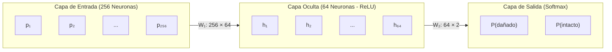
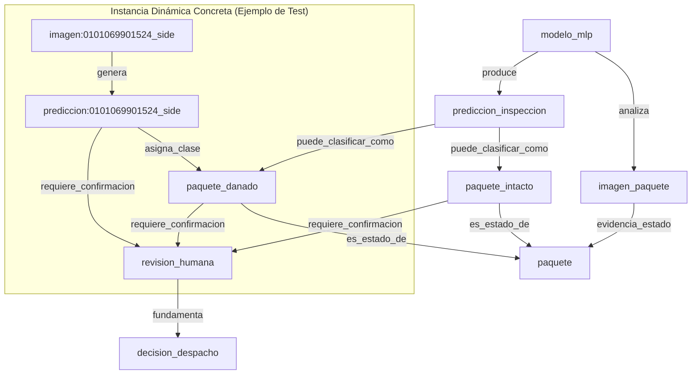
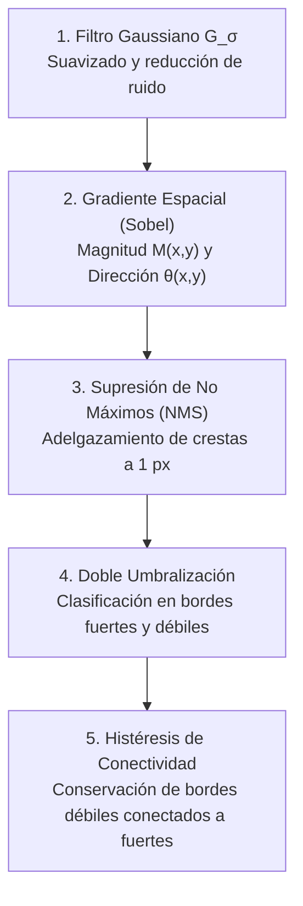
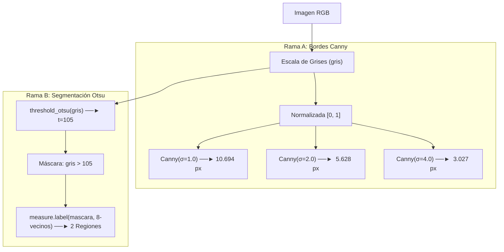

# Guía Integral de Estudio y Sustentación: Semanas 08 y 09
## Reconocimiento Visual (MLP), Evidencia, Ontología y Segmentación Clásica (Canny + Otsu)

> **Proyecto:** IA Logística Amazon Last Mile — Detección, Reconocimiento y Visión Artificial  
> **Ámbitos cubiertos:**  
> - **Semana 08:** `src/vision/` (`particion.py`, `modelo_mlp.py`, `ontologia.py`, `evidencia_mlp.py`), MLP visual, partición estratificada por grupo, línea base, ontología GraphML (NetworkX) y persistencia relacional PostgreSQL/Alembic.  
> - **Semana 09:** `src/vision/escena_semana09.py`, `src/semana09_vision.py`, procesamiento clásico de imágenes (RGB $\to$ Gris $\to$ Canny con $\sigma \in \{1, 2, 4\}$, Umbralización Otsu, 8-conectividad y segmentación de componentes).  
> - **Arquitectura & Plataforma:** Capa API (FastAPI, DTOs Pydantic, integridad SHA-256) y Frontend (`dashboard/` en React 19 + Vite).  
> - **Banco de Preguntas para Sustentación:** Trampas conceptuales, justificaciones de diseño y defensas orales.

---

## Tabla de Contenido

1. [Visión Panorámica y Continuidad Pedagógica](#1-visión-panorámica-y-continuidad-pedagógica)
   - [1.1 Evolución del Proyecto: de Semana 7 a Semanas 8 y 9](#11-evolución-del-proyecto-de-semana-7-a-semanas-8-y-9)
   - [1.2 Adaptación al Dominio Logístico vs Ejercicios de Clase](#12-adaptación-al-dominio-logístico-vs-ejercicios-de-clase)
   - [1.3 Fundamentos de Python en Semana 8 (`@property`, Tuplas `...`, `*` y `raise`)](#13-fundamentos-de-python-en-semana-8-property-tuplas--y-raise)
2. [Semana 08: Reconocimiento con Redes Neuronales (MLP) y Evidencia](#2-semana-08-reconocimiento-con-redes-neuronales-mlp-y-evidencia)
   - [2.1 El Problema de Negocio: Inspección de Integridad (`intacto` vs `danado`)](#21-el-problema-de-negocio-inspección-de-integridad-intacto-vs-danado)
   - [2.2 Conjunto de Datos y Blindaje Contra Data Leakage (`particion.py`)](#22-conjunto-de-datos-y-blindaje-contra-data-leakage-particionpy)
   - [2.3 Vectorización y Preprocesamiento de Imágenes (16×16 Lanczos)](#23-vectorización-y-preprocesamiento-de-imágenes-1616-lanczos)
   - [2.4 El Modelo Perceptrón Multicapa (`MLPClassifier`)](#24-el-modelo-perceptrón-multicapa-mlpclassifier)
   - [2.5 Línea Base Mayoritaria (`DummyClassifier`) y Honestidad Intelectual](#25-línea-base-mayoritaria-dummyclassifier-y-honestidad-intelectual)
   - [2.6 Desglose de Métricas: Accuracy, F1-Score, Matriz de Confusión y Convergencia](#26-desglose-de-métricas-accuracy-f1-score-matriz-de-confusión-y-convergencia)
3. [Semana 08: Ontología y Representación Semántica (`ontologia.py`)](#3-semana-08-ontología-y-representación-semántica-ontologiapy)
   - [3.1 ¿Por qué una Ontología? De la Probabilidad Numérica al Significado](#31-por-qué-una-ontología-de-la-probabilidad-numérica-al-significado)
   - [3.2 Estructura del Grafo Semántico en NetworkX y GraphML](#32-estructura-del-grafo-semántico-en-networkx-y-graphml)
   - [3.3 Las 10 Relaciones Canónicas y la Inyección Dinámica de Muestras](#33-las-10-relaciones-canónicas-y-la-inyección-dinámica-de-muestras)
   - [3.4 El Principio *Human-in-the-Loop* en Decisiones de Despacho](#34-el-principio-human-in-the-loop-en-decisiones-de-despacho)
4. [Semana 08: Persistencia de Evidencia e Integridad Criptográfica (`evidencia_mlp.py`)](#4-semana-08-persistencia-de-evidencia-e-integridad-criptográfica-evidencia_mlppy)
   - [4.1 PostgreSQL + Alembic vs SQLite](#41-postgresql--alembic-vs-sqlite)
   - [4.2 Esquema Relacional de Tablas (`imagenes`, `modelos_visuales`, `muestras_modelo_visual`)](#42-esquema-relacional-de-tablas-imagenes-modelos_visuales-muestras_modelo_visual)
   - [4.3 Inmutabilidad, Idempotencia y Trazabilidad por Hashes SHA-256](#43-inmutabilidad-idempotencia-y-trazabilidad-por-hashes-sha-256)
5. [Semana 09: Características, Contornos y Segmentación Clásica](#5-semana-09-características-contornos-y-segmentación-clásica)
   - [5.1 La Escena Logística Sintética Propia (`escena_semana09.py`)](#51-la-escena-logística-sintética-propia-escena_semana09py)
   - [5.2 Extracción de Características Globales: Intensidad, Color y Textura](#52-extracción-de-características-globales-intensidad-color-y-textura)
   - [5.3 Detección de Bordes Canny: Fundamento Teórico y Algoritmo Paso a Paso](#53-detección-de-bordes-canny-fundamento-teórico-y-algoritmo-paso-a-paso)
   - [5.4 Sensibilidad del Parámetro $\sigma$ (1.0 vs 2.0 vs 4.0) y sus Métricas](#54-sensibilidad-del-parámetro-sigma-10-vs-20-vs-40-y-sus-métricas)
   - [5.5 Umbralización Global de Otsu: Maximización de Varianza Inter-Clase](#55-umbralización-global-de-otsu-maximización-de-varianza-inter-clase)
   - [5.6 Componentes Conexas (Etiquetado con 8-conectividad)](#56-componentes-conexas-etiquetado-con-8-conectividad)
   - [5.7 La Gran Trampa Conceptual: «2 Regiones Conectadas $\neq$ 2 Paquetes Físicos»](#57-la-gran-trampa-conceptual-2-regiones-conectadas-neq-2-paquetes-físicos)
   - [5.8 Independencia de Canny y Otsu: ¿Por qué variar $\sigma$ no altera las regiones?](#58-independencia-de-canny-y-otsu-por-qué-variar-sigma-no-altera-las-regiones)
6. [Arquitectura del Sistema: FastAPI y Dashboard React 19](#6-arquitectura-del-sistema-fastapi-y-dashboard-react-19)
   - [6.1 Servicios Backend: `modelo_visual.py` y `vision_semana09.py`](#61-servicios-backend-modelo_visualpy-y-vision_semana09py)
   - [6.2 Estrategia de Cómputo: Procesamiento Asíncrono Offline vs En Tiempo Real](#62-estrategia-de-cómputo-procesamiento-asíncrono-offline-vs-en-tiempo-real)
   - [6.3 Control de Integridad y Códigos HTTP (`503 Service Unavailable`)](#63-control-de-integridad-y-códigos-http-503-service-unavailable)
   - [6.4 Frontend Órbita: Vistas `MlpView.jsx` y `Semana09View.jsx`](#64-frontend-órbita-vistas-mlpviewjsx-y-semana09viewjsx)
7. [Simulador de Sustentación Oral (Preguntas de Examen y Respuestas Modelo)](#7-simulador-de-sustentación-oral-preguntas-de-examen-y-respuestas-modelo)

---

## 1. Visión Panorámica y Continuidad Pedagógica

### 1.1 Evolución del Proyecto: de Semana 7 a Semanas 8 y 9

El proyecto formativo estructura el aprendizaje de Inteligencia Artificial en una progresión sistemática:

```mermaid
flowchart LR
    subgraph Sem7["Semana 07: Representaciones"]
        S7A["Vectores R³ (IQR)"]
        S7B["Simbólica (P75 + Reglas)"]
        S7C["Autómata Finito (POD)"]
    end
    
    subgraph Sem8["Semana 08: Aprendizaje & Significado"]
        S8A["Imágenes sintéticas (960×540)"]
        S8B["MLPClassifier (256 entradas)"]
        S8C["Ontología GraphML (Semántica)"]
        S8D["Persistencia PostgreSQL (Auditada)"]
    end
    
    subgraph Sem9["Semana 09: Visión Clásica & Segmentación"]
        S9A["Escena logística determinista"]
        S9B["Canny Multi-Escala (σ=1,2,4)"]
        S9C["Umbralización Otsu (t=105)"]
        S9D["Componentes Conexas (8 vecinos)"]
    end

    Sem7 -->|De reglas estáticas a modelos entrenados| Sem8
    Sem8 -->|De caja negra neuronal a inspección morfométrica previa| Sem9
```



1. **Semana 07 (Representaciones):** Definimos el estado logístico mediante tres perspectivas abstractas: geométrica (distancia euclidiana robusta por IQR), declarativa (sistemas basados en reglas sobre percentiles) y secuencial (autómata determinista de protocolo de entrega).
2. **Semana 08 (Reconocimiento & Semántica):** Damos el salto al aprendizaje supervisado conexionista. Una red neuronal artificial (MLP) intenta clasificar si un paquete está intacto o averiado a partir de patrones de intensidad de píxeles. La predicción probabilística se contextualiza en un grafo ontológico formal para justificar decisiones de despacho, y todo el experimento se sella en PostgreSQL con auditoría criptográfica.
3. **Semana 09 (Visión Clásica):** Analizamos la etapa *previa* indispensable en cualquier sistema de visión artificial: la segmentación y extracción de primitivas visuales (bordes y regiones homogéneas) sin entrenamiento, evaluando los límites matemáticos de técnicas deterministas clásicas frente a la geometría física tridimensional.

### 1.2 Adaptación al Dominio Logístico vs Ejercicios de Clase

| Dimensión | Enunciado / Guía de Clase Genérica | Adaptación Real en `ia-proyecto` | Justificación de Ingeniería |
| :--- | :--- | :--- | :--- |
| **Problema Semana 08** | Clasificar dígitos escritos a mano (`load_digits` de scikit-learn, 8×8). | Clasificar integridad física de paquetes de última milla (`danado` vs `intacto`). | Relevancia directa con el dominio del proyecto de distribución Amazon. |
| **Persistencia Semana 08** | Guardar resultados en base de datos local SQLite mediante script suelto. | PostgreSQL con migraciones transaccionales Alembic (`0003` y `0004`), modelos SQLAlchemy y volumen privado. | Arquitectura corporativa reproducible, concurrente y de única fuente de verdad. |
| **Ontología Semana 08** | Grafo conceptual genérico o abstracto. | Grafo formal con NetworkX (`ontologia_logistica.graphml`) que modela el flujo de auditoría y decisión de despacho con intervención humana obligatoria (*Human-in-the-Loop*). | Cumplimiento del principio de explicabilidad (XAI) y ética operativa. |
| **Imagen Semana 09** | Monedas estándar (`skimage.data.coins()`). | Escena logística original de 960×540 px generada por código (`escena_semana09.py`) con caja 3D, banda transportadora, etiqueta y rasgadura. | Evita plagio de imágenes de internet, previene violaciones de copyright y provee una escena con control geométrico paramétrico. |
| **Pipeline Semana 09** | Demostración interactiva básica en Jupyter Notebook. | CLI desacoplado (`src/semana09_vision.py`), validación de hash de entrada, API REST con HTTP 503 por desincronización y panel interactivo en React 19. | Separación estricta de responsabilidades (SoC), robustez y reproducibilidad de nivel productivo. |


### 1.3 Fundamentos de Python en Semana 8 (`@property`, Tuplas `...`, `*` y `raise`)

Para entender con soltura el código de `src/vision/particion.py` y `modelo_mlp.py`, se emplean varios patrones idiomáticos del Python moderno:

#### A. El Decorador `@property` (Propiedad Calculada / Getter de Solo Lectura)
Convierte un método en un atributo de solo lectura. Permite acceder a una computación dinámica **sin paréntesis `()`**:
```python
@property
def X_train(self) -> np.ndarray:
    return np.stack([self.muestras[i].vector for i in self.indices_train])
```
* **Evaluación perezosa (*Lazy Evaluation*):** La matriz pesada de $150 \times 256$ flotantes no se almacena duplicada en memoria; se genera en el milisegundo exacto en que el modelo la solicita para entrenar.
* **Inmutabilidad estricta:** Al no definir un setter (`@X_train.setter`), cualquier intento de reasignar (`particion.X_train = ...`) arroja `AttributeError`, blindando los datos de entrenamiento.
* **Compatibilidad idiomática:** Permite la sintaxis limpia de scikit-learn: `modelo.fit(particion.X_train, particion.y_train)`.

#### B. El Objeto `Ellipsis` (`...`) en Tuplas Homogéneas
En la firma `muestras: tuple[MuestraVisual, ...]`, los tres puntos representan el singleton built-in `Ellipsis`:
* `tuple[str, int]`: Modela una tupla de **longitud fija de exactamente 2 elementos** heterogéneos.
* `tuple[MuestraVisual, ...]`: Indica una tupla de **longitud variable arbitraria** (0, 50, 200 o más) donde **todos** los elementos son homogéneos y de tipo `MuestraVisual`.

#### C. El Asterisco Solitario `*` (Argumentos Solo por Palabra Clave / Keyword-Only — PEP 3102)
En la firma:
```python
def separar_grupos(muestras: tuple[MuestraVisual, ...], *, semilla: int = SEMILLA_PARTICION, ...)
```
El `*` suelto establece una **frontera obligatoria**: cualquier parámetro a su derecha **no puede pasarse por posición**, exige obligatoriamente ser nombrado (`semilla=20260925`). Esto previene errores de paso accidental de números y fuerza código legible y auto-documentado.

#### D. La Instrucción `raise` (Disparo de Excepciones)
Es el equivalente en Python a `throw` en JavaScript, Java o C#. Detiene inmediatamente el flujo de ejecución de la función y propaga el error:
```python
if not 0 < fraccion_prueba < 1:
    raise ValueError("La fracción de prueba debe estar entre 0 y 1.")
```
Se utiliza `raise ErrorVisual(...)` para excepciones del dominio de visión y `raise ValueError(...)` para violaciones de argumentos matemáticos.

---

## 2. Semana 08: Reconocimiento con Redes Neuronales (MLP) y Evidencia

### 2.1 El Problema de Negocio: Inspección de Integridad (`intacto` vs `danado`)

En una estación de distribución (*Delivery Station*), los paquetes circulan a alta velocidad sobre rodillos antes de ser asignados a furgonetas de reparto. Despachar un paquete roto genera insatisfacción en el cliente final, devoluciones costosas y posibles demandas de garantía. El objetivo es evaluar la viabilidad de utilizar un clasificador visual de bajo costo para prefiltrar bultos averiados antes de su carga.

### 2.2 Conjunto de Datos y Blindaje Contra Data Leakage (`particion.py`)

El piloto auditado consta de **200 imágenes sintéticas** en vista lateral (`side`), equilibradas exactamente en **100 paquetes intactos** y **100 paquetes dañados**.

```
            [ 200 Imágenes Sintéticas Auditadas ]
                             │
     ┌───────────────────────┴───────────────────────┐
     ▼                                               ▼
Train: 150 imágenes (75%)                      Test: 50 imágenes (25%)
75 dañados / 75 intactos                       25 dañados / 25 intactos
     │                                               │
     ▼                                               ▼
Ajuste de Pesos Sinápticos                     Evaluación Única Reservada
(Backpropagation + Adam)                       (Métricas Reportadas)
```

#### Blindaje por Grupos (*Group Leakage Prevention*):
En visión por computadora, si un mismo objeto es fotografiado desde ángulos ligeramente distintos y cae simultáneamente en entrenamiento y prueba, el modelo memoriza la textura del fondo o la iluminación en lugar de aprender el concepto ("fuga de datos" o *data leakage*).
* El módulo [`src/vision/particion.py`](file:///Users/jyarar/projects/u/x-semestre/ia-proyecto/src/vision/particion.py#L84-L138) utiliza `separar_grupos()`: la partición se hace **a nivel de grupo de origen (`grupo_origen`)**, garantizando que ninguna identidad cruce entre entrenamiento y evaluación.
* Se fija la semilla pseudoaleatoria determinista `SEMILLA_PARTICION = 20260925`.
* Partición: **75% entrenamiento (150 muestras)** y **25% prueba (50 muestras)**, exactamente estratificada por clase (75/75 en train, 25/25 en test).

### 2.3 Vectorización y Preprocesamiento de Imágenes (16×16 Lanczos)

Cada imagen de entrada posee una resolución de 960 × 540 píxeles en RGB.
1. **Conversión a Escala de Grises (`L`):** Se descartan los canales cromáticos y se retiene únicamente la luminancia, reduciendo la dimensionalidad por un factor de 3 sin perder información de contraste o fracturas.
2. **Remuestreo Lanczos a 16×16:**  
   $$\text{Resolución: } 16 \times 16 = 256 \text{ píxeles}$$  
   El filtro sinc de Lanczos preserva los bordes de alta frecuencia mucho mejor que una interpolación bilineal o por vecino más cercano.
3. **Normalización Lineal a $[0, 1]$:**  
   $$x_j = \frac{\text{pixel}_j}{255.0} \in [0.0, 1.0], \quad \forall j \in \{1, \dots, 256\}$$  
   Evita la saturación prematura de las funciones de activación no lineales en la red neuronal.

### 2.4 El Modelo Perceptrón Multicapa (`MLPClassifier`)

Configuración en [`src/vision/modelo_mlp.py`](file:///Users/jyarar/projects/u/x-semestre/ia-proyecto/src/vision/modelo_mlp.py#L20-L22):
```python
PARAMETROS_MLP = {
    "hidden_layer_sizes": (64,),
    "max_iter": 400,
    "random_state": 42
}
```



* **Capa de entrada:** 256 neuronas correspondientes al vector aplanado de 16×16.
* **Capa oculta:** 1 capa con 64 neuronas y función de activación **ReLU** ($f(z) = \max(0, z)$).
* **Capa de salida:** 2 neuronas con activación Softmax para emitir probabilidades posteriores $P(\text{danado})$ y $P(\text{intacto})$.
* **Optimizador:** Adam (tasa de aprendizaje adaptativa con momentos de primer y segundo orden).
* **Parámetros entrenables totales:**  
  $$\text{Pesos } W_1 = 256 \times 64 = 16.384, \quad \text{Sesgos } b_1 = 64$$  
  $$\text{Pesos } W_2 = 64 \times 2 = 128, \quad \text{Sesgos } b_2 = 2$$  
  $$\text{Total Parámetros} = 16.384 + 64 + 128 + 2 = \mathbf{16.578 \text{ parámetros}}$$

### 2.5 Línea Base Mayoritaria (`DummyClassifier`) y Honestidad Intelectual

Para evaluar rigurosamente cualquier modelo de aprendizaje automático, **el valor absoluto de accuracy no significa nada sin una línea base (*baseline*)**.
* En nuestro conjunto de prueba, hay 25 paquetes dañados y 25 intactos (distribución 50/50 perfecta).
* Un clasificador trivial que siempre predijera "dañado" sin mirar la imagen obtendría exactamente:
  $$\text{Accuracy Baseline} = \frac{25}{50} = \mathbf{0,500 \ (50,0\%)}$$

### 2.6 Desglose de Métricas: Accuracy, F1-Score, Matriz de Confusión y Convergencia

Al ejecutar [`src.semana08_reconocimiento`](file:///Users/jyarar/projects/u/x-semestre/ia-proyecto/src/semana08_reconocimiento.py) sobre el conjunto reservado de prueba (50 imágenes nunca vistas en entrenamiento), los resultados medidos fueron:

| Métrica | MLP Entrenado | Línea Base Mayoritaria |
| :--- | :---: | :---: |
| **Accuracy Global** | **0,480 (48,0%)** | **0,500 (50,0%)** |
| **F1-Score Dañado** | 0,500 | 0,000 / 0,667 |
| **F1-Score Intacto** | 0,458 | 0,000 / 0,667 |

#### Matriz de Confusión ($N=50$):
$$\begin{array}{c|cc}
\text{Real} \backslash \text{Predicha} & \textbf{Dañado} & \textbf{Intacto} \\
\hline
\textbf{Dañado (25)} & 13 \text{ (Verdaderos Positivos)} & 12 \text{ (Falsos Negativos)} \\
\textbf{Intacto (25)} & 14 \text{ (Falsos Positivos)} & 11 \text{ (Verdaderos Negativos)}
\end{array}$$

#### Diagnóstico Técnico y de Convergencia:
1. **Advertencia de Convergencia (`ConvergenceWarning`):**  
   El optimizador Adam agotó el límite de `max_iter=400` sin que la función de pérdida log-loss lograra estabilizarse por debajo del umbral de tolerancia (`tol=1e-4`).
2. **Conclusión Científica Fundamental:**  
   $$\text{Accuracy}_{\text{MLP}} (48\%) < \text{Accuracy}_{\text{Baseline}} (50\%)$$  
   El modelo entrenado se desempeña **por debajo de una moneda al aire**.
3. **¿Por qué falló el modelo?**
   * **Resolución insuficiente:** Reducir la imagen a 16×16 píxeles destruye las fisuras y micro-roturas de cartón; una rasgadura de 5 mm desaparece en un promedio de bloque.
   * **Volumen de datos:** 150 imágenes de entrenamiento son ínfimas para que 16.578 parámetros neuronales generalicen patrones visuales espaciales sin colapsar.
   * **Ausencia de capas convolucionales (CNN):** Un MLP ignora la correlación espacial 2D adyacente; trata cada píxel como una variable independiente desordenada.
4. **Valor Académico del Resultado:**  
   En la sustentación, presentar un 48% con honestidad, explicando **por qué no debe utilizarse este modelo para automatizar despachos**, demuestra un criterio de ingeniería muy superior a quien "ajusta" o fuerza métricas falsas del 99% mediante sobreajuste (*overfitting*).

---

## 3. Semana 08: Ontología y Representación Semántica (`ontologia.py`)

### 3.1 ¿Por qué una Ontología? De la Probabilidad Numérica al Significado

Un modelo neuronal devuelve un vector continuo de probabilidades: `[0.58, 0.42]`. Sin embargo, un sistema informático empresarial no puede tomar acciones basándose en un número frío. Se requiere una **representación del conocimiento** que defina qué significa esa predicción, qué entidades afecta y qué reglas de gobierno corporativo deben regir el proceso.

### 3.2 Estructura del Grafo Semántico en NetworkX y GraphML

El módulo [`src/vision/ontologia.py`](file:///Users/jyarar/projects/u/x-semestre/ia-proyecto/src/vision/ontologia.py) modela un grafo dirigido formal (`nx.DiGraph`) exportado en formato estándar de intercambio semántico XML **GraphML** (`artifacts/semana08/ontologia_logistica.graphml`).



### 3.3 Las 10 Relaciones Canónicas y la Inyección Dinámica de Muestras

El grafo estático posee **10 aristas estructurales ontológicas**:
1. `(modelo_mlp, analiza, imagen_paquete)`
2. `(modelo_mlp, produce, prediccion_inspeccion)`
3. `(imagen_paquete, evidencia_estado, paquete)`
4. `(prediccion_inspeccion, puede_clasificar_como, paquete_intacto)`
5. `(prediccion_inspeccion, puede_clasificar_como, paquete_danado)`
6. `(paquete_intacto, es_estado_de, paquete)`
7. `(paquete_danado, es_estado_de, paquete)`
8. `(paquete_intacto, requiere_confirmacion, revision_humana)`
9. `(paquete_danado, requiere_confirmacion, revision_humana)`
10. `(revision_humana, fundamenta, decision_despacho)`

Cuando se evalúa una muestra específica de prueba en el laboratorio o CLI (`prediccion is not None`), se instancian dinámicamente **3 aristas adicionales** (totalizando **13 relaciones**):
11. `(imagen:{id_origen}, genera, prediccion:{id_origen})`
12. `(prediccion:{id_origen}, asigna_clase, paquete_{clase})`
13. `(prediccion:{id_origen}, requiere_confirmacion, revision_humana)`

### 3.4 El Principio *Human-in-the-Loop* en Decisiones de Despacho

Nótese que en la ontología **no existe una arista directa** entre `prediccion_inspeccion` y `decision_despacho`.
* **Justificación de diseño ético y legal:** Dado que el MLP tiene un accuracy del 48%, permitir que la red apruebe o rechace paquetes automáticamente generaría caos en la operación logística.
* Toda predicción está semánticamente forzada a transitar por `revision_humana`. La IA asiste al inspector marcando la sospecha, pero la firma de despacho siempre requiere el criterio de un operador humano.

---

## 4. Semana 08: Persistencia de Evidencia e Integridad Criptográfica (`evidencia_mlp.py`)

### 4.1 PostgreSQL + Alembic vs SQLite

* **Por qué no SQLite:** La guía de clase sugería un archivo local SQLite. En un entorno logístico distribuido, SQLite bloquea concurrentemente el archivo ante escrituras (`SQLITE_BUSY`), carece de tipos de datos estrictos y desacopla la base de datos de los pipelines de integración continua.
* **Solución adoptada:** Se integró PostgreSQL con control de versiones de esquema mediante **Alembic**, creando migraciones declarativas y reversibles:
  * `0003_piloto_visual`: Registro del dataset de 200 imágenes y asociaciones simuladas.
  * `0004_mlp_visual`: Registro formal de ejecuciones del modelo, hiperparámetros y predicciones reservadas.

### 4.2 Esquema Relacional de Tablas (`imagenes`, `modelos_visuales`, `muestras_modelo_visual`)

```
   ┌───────────────────────┐
   │        dataset        │
   ├───────────────────────┤
   │ id (PK)               │
   │ sha256 (Hash global)  │
   └──────────┬────────────┘
              │ 1:N
   ┌──────────┴────────────┐            1:N            ┌───────────────────────────────┐
   │       imagenes        │◄──────────────────────────┤     muestras_modelo_visual    │
   ├───────────────────────┤                           ├───────────────────────────────┤
   │ id (PK)               │                           │ id (PK)                       │
   │ dataset_id (FK)       │                           │ modelo_id (FK) ───────────────┼───┐
   │ id_origen             │                           │ imagen_id (FK)                │   │
   │ grupo_origen          │                           │ split ('train' | 'test')      │   │
   │ etiqueta              │                           │ clase_predicha                │   │
   │ sha256                │                           │ probabilidad                  │   │
   │ ruta_relativa         │                           └───────────────────────────────┘   │
   └───────────────────────┘                                                               │
                                                       ┌───────────────────────────────┐   │
                                                       │        modelos_visuales       │   │
                                                       ├───────────────────────────────┤   │
                                                       │ id (PK) ◄─────────────────────┘
                                                       │ version ('mlp-visual-v1')     │
                                                       │ manifiesto_sha256             │
                                                       │ artefacto_sha256 (.pkl)       │
                                                       │ metadatos_json                │
                                                       └───────────────────────────────┘
```

### 4.3 Inmutabilidad, Idempotencia y Trazabilidad por Hashes SHA-256

En [`src/vision/evidencia_mlp.py`](file:///Users/jyarar/projects/u/x-semestre/ia-proyecto/src/vision/evidencia_mlp.py#L18-L93), el registro sigue un protocolo de seguridad bancario:
1. **Verificación de Entrada:** Valida que el SHA-256 del manifiesto en memoria coincida exactamente con el hash del dataset en PostgreSQL.
2. **Hash del Artefacto Binario:** Se calcula `sha256(modelo_mlp_logistica.pkl)`. Si el archivo serializado cambia un solo bit, la inserción se aborta con `ErrorVisual`.
3. **Inmutabilidad de Etiquetas:** Jamás se actualizan los campos `etiqueta` de las imágenes originales. Las predicciones del modelo se insertan en la tabla separada `muestras_modelo_visual`.
4. **Idempotencia Estricta:** Si se ejecuta el comando `--registrar` dos veces consecutivas, el sistema detecta que el registro ya existe con idénticos hashes y retorna `(modelo, False)` sin duplicar filas ni lanzar excepciones. Si el contenido difiere para la misma versión, lanza una excepción de colisión.

---

## 5. Semana 09: Características, Contornos y Segmentación Clásica

### 5.1 La Escena Logística Sintética Propia (`escena_semana09.py`)

Para cumplir la consigna de visión artificial evitando fotos ajenas con restricciones de propiedad intelectual, el script [`src/vision/escena_semana09.py`](file:///Users/jyarar/projects/u/x-semestre/ia-proyecto/src/vision/escena_semana09.py) dibuja deterministamente una escena de 960 × 540 píxeles (`semilla = 20260930`):
* **Fondo:** Gradiente oscuro con adición de ruido gaussiano ($\mu=0, \sigma=2,2$) y una banda transportadora en perspectiva inclinada (gris oscuro `(40, 52, 61)` con ranuras de tracción cada 93 píxeles).
* **Caja de Cartón Tridimensional:** Tres polígonos rellenos con distintas intensidades que simulan las caras superior (`(225, 186, 128)`), frontal derecha (`(200, 151, 91)`) y lateral izquierda (`(165, 116, 70)`).
* **Líneas de Contorno y Aristas:** Trazadas con ancho de 4 píxeles en color marrón oscuro (`(92, 66, 48)`).
* **Detalles Morfológicos Reales:** Cinta adhesiva de embalaje, etiqueta blanca con código de barras legible (`PKG-09 / REVISION`) y una **rasgadura irregular oscura** (`(74, 53, 43)`).

### 5.2 Extracción de Características Globales: Intensidad, Color y Textura

Medidas calculadas por [`src/semana09_vision.py`](file:///Users/jyarar/projects/u/x-semestre/ia-proyecto/src/semana09_vision.py#L30-L71) sobre la imagen generada:
* **Intensidad Luminosa Media:** **71,35 / 255** (Desviación estándar: **56,16**).  
  *Interpretación:* La distribución es marcadamente bimodal: una gran masa de píxeles oscuros (fondo y banda) y una meseta de píxeles claros (las caras de la caja de cartón).
* **Color Medio RGB:** **(74,26; 71,08; 66,29)**.  
  *Interpretación:* Ligero predominio del canal rojo y verde sobre el azul (tono cálido característico del cartón kraft y la cinta adhesiva), pero el promedio global no permite segmentar por sí solo.
* **Textura:** Los barrotes de la banda transportadora y las líneas del código de barras generan alta frecuencia espacial detectable como gradientes locales pronunciados.

---

### 5.3 Detección de Bordes Canny: Fundamento Teórico y Algoritmo Paso a Paso

El algoritmo de John F. Canny (1986) es el estándar óptimo de detección de bordes y opera en **5 etapas matemáticas rigurosas**:



#### Paso 1: Suavizado Gaussiano
La imagen en escala de grises $I(x,y)$ se convoluciona con un núcleo gaussiano bidimensional:
$$G_\sigma(x, y) = \frac{1}{2\pi\sigma^2} \exp\left(-\frac{x^2 + y^2}{2\sigma^2}\right)$$
$$I_\sigma(x, y) = I(x, y) * G_\sigma(x, y)$$
El parámetro $\sigma$ controla el radio de dispersión de la campana: a mayor $\sigma$, mayor desenfoque y mayor eliminación de textura fina.

#### Paso 2: Cálculo del Gradiente de Intensidad
Se aplican los operadores de Sobel horizontal ($K_x$) y vertical ($K_y$) para obtener las derivadas espaciales parciales:
$$g_x = \frac{\partial I_\sigma}{\partial x}, \quad g_y = \frac{\partial I_\sigma}{\partial y}$$
$$\text{Magnitud: } M(x, y) = \sqrt{g_x^2 + g_y^2}, \quad \text{Dirección: } \theta(x, y) = \arctan\left(\frac{g_y}{g_x}\right)$$

#### Paso 3: Supresión de No Máximos (NMS - *Non-Maximum Suppression*)
El gradiente produce bordes gruesos y difusos. NMS cuantiza $\theta(x,y)$ en 4 direcciones cardinales discretas ($0^\circ, 45^\circ, 90^\circ, 135^\circ$). Si el valor $M(x,y)$ del píxel central no es estrictamente mayor que el de sus dos vecinos en la dirección del gradiente ortogonal, su intensidad se reduce a cero. Esto **adelgaza los bordes a 1 píxel de espesor**.

#### Paso 4: Umbralización con Doble Umbral (*Double Thresholding*)
Se fijan dos umbrales: $T_{\text{alto}}$ y $T_{\text{bajo}}$:
* Si $M(x, y) \ge T_{\text{alto}} \implies$ **Borde Fuerte** (Píxel confirmado).
* Si $T_{\text{bajo}} \le M(x, y) < T_{\text{alto}} \implies$ **Borde Débil** (Candidato en evaluación).
* Si $M(x, y) < T_{\text{bajo}} \implies$ **Supresión total** (Ruido descartado).

#### Paso 5: Seguimiento de Bordes por Histéresis
Un borde débil se confirma como borde verdadero **si y solo si** está conectado espacialmente (en su vecindad de 8 píxeles) con al menos un borde fuerte. Si es una isla aislada, se elimina. Esto previene que líneas de bordes reales queden fragmentadas con huecos.

---

### 5.4 Sensibilidad del Parámetro $\sigma$ (1.0 vs 2.0 vs 4.0) y sus Métricas

En nuestro experimento, evaluamos la sensibilidad del algoritmo Canny variando la escala del filtro gaussiano $\sigma \in \{1.0, 2.0, 4.0\}$ sobre los $518.400$ píxeles totales de la imagen:

| Parámetro $\sigma$ | Píxeles de Borde Detectados | Densidad de Bordes | Observación Morfológica en la Evidencia |
| :---: | :---: | :---: | :--- |
| **$\sigma = 1.0$** | **10.694 px** | **2,06%** | **Sobredetalle (Ruidoso):** Detecta aristas de la caja, pero también las ranuras mecánicas de la banda, el texto "PKG-09" y cada barra del código de barras. |
| **$\sigma = 2.0$** | **5.628 px** | **1,09%** | **Equilibrio Óptimo (Referencia):** El contorno perimetral del paquete y las divisiones de las caras se retienen claramente, mientras que la textura de la banda se desvanece. |
| **$\sigma = 4.0$** | **3.027 px** | **0,58%** | **Subfiltrado (Pérdida de Información):** Se eliminan por completo las líneas de la banda transportadora, pero desaparecen las líneas finas de la etiqueta y parte de la rasgadura. |

---

### 5.5 Umbralización Global de Otsu: Maximización de Varianza Inter-Clase

El método de Nobuyuki Otsu (1979) es un algoritmo de umbralización global no paramétrico y no supervisado. Encuentra el umbral óptimo $t^* \in [0, 255]$ que divide el histograma de intensidades en dos clases: fondo $C_0 = [0, \dots, t]$ y objeto $C_1 = [t+1, \dots, 255]$.

#### Formulación Matemática:
La varianza total de la imagen es constante: $\sigma_T^2 = \sigma_w^2(t) + \sigma_b^2(t)$.  
Minimizar la varianza intra-clase $\sigma_w^2(t)$ equivale exactamente a **maximizar la varianza entre clases (*inter-class variance*) $\sigma_b^2(t)$**:

$$\sigma_b^2(t) = \omega_0(t) \, \omega_1(t) \, \left[\mu_0(t) - \mu_1(t)\right]^2$$

Donde:
* $\omega_0(t) = \sum_{i=0}^t p_i$ es la probabilidad acumulada de pertenecer al fondo.
* $\omega_1(t) = \sum_{i=t+1}^{255} p_i = 1 - \omega_0(t)$ es la probabilidad acumulada de pertenecer al objeto.
* $\mu_0(t)$ y $\mu_1(t)$ son las medias de intensidad de cada clase.

Otsu barre exhaustivamente los 256 posibles valores de $t$ y selecciona:
$$t^* = \arg\max_{0 \le t < 255} \sigma_b^2(t)$$

#### Resultado en Nuestra Escena:
* **Umbral Óptimo de Otsu:** **$t = 105 / 255$** ($\approx 0,412$ normalizado).
* **Píxeles en la Máscara Binaria (`gris > 105`):** **119.925 píxeles (23,13% de la superficie)**.
* Todo píxel con intensidad $> 105$ se etiqueta como objeto (blanco); el resto como fondo (negro).

---

### 5.6 Componentes Conexas (Etiquetado con 8-conectividad)

Una vez obtenida la máscara binaria booleana, el algoritmo de componentes conexas agrupa píxeles contiguos asignándoles un identificador entero único ($1, 2, \dots, K$).

#### 4-Conectividad vs 8-Conectividad:
* **4-conectividad (`connectivity=1`):** Dos píxeles son vecinos solo si comparten un lado horizontal o vertical.
* **8-conectividad (`connectivity=2`):** Dos píxeles son vecinos si comparten un lado o una **esquina diagonal**. En `ia-proyecto` se configuró explícitamente 8-conectividad para permitir que trazos diagonales no queden rotos artificialmente.

#### Conteo de Regiones Obtenido:
* **Número total de regiones conectadas:** **2 componentes**.
* **Distribución de Áreas:**
  * **Región 1 (Mayor):** **98.085 píxeles** (Corresponde a la cara frontal derecha y lateral izquierda de la caja).
  * **Región 2:** **21.840 píxeles** (Corresponde a la tapa superior de la caja).

---

### 5.7 La Gran Trampa Conceptual: «2 Regiones Conectadas $\neq$ 2 Paquetes Físicos»

> [!WARNING]
> **Pregunta Clásica de Examen:** *"El algoritmo reportó 2 componentes conexas. ¿Significa eso que sobre la banda transportadora hay dos paquetes?"*  
> **Respuesta:** **ROTUNDAMENTE NO.** Hay un único paquete físico.

```
       ┌───────────────────────────────┐
       │   Cara Superior (Clara)       │ ──► Región Conexa #2 (Área: 21.840 px)
       └───────────────┬───────────────┘
                       │ ◄── [ Arista / Junta Oscura: Gris ≤ 105 ]
       ┌───────────────┴───────────────┐
       │ Caras Frontal/Lateral (Claras)│ ──► Región Conexa #1 (Área: 98.085 px)
       └───────────────────────────────┘
```

#### Explicación Causal de la Fragmentación:
1. **La Arista Tridimensional Separa las Regiones:** La caja tiene un pliegue oscuro en la esquina superior (`(92, 66, 48)`). La intensidad de esa línea cae por debajo del umbral de Otsu ($< 105$).
2. **Corte Topológico:** Esa línea oscura crea una barrera de píxeles negros que desconecta totalmente los píxeles claros de la tapa de los píxeles claros del frente.
3. **Agujeros Internos (*Holes*):** La etiqueta adhesiva blanca forma parte de la región clara, pero las letras negras `"PKG-09"`, el código de barras y la rasgadura quedan como agujeros negros no conectados en la máscara.
4. **Lección de Ingeniería:** El etiquetado de componentes conexas mide **conectividad topológica de píxeles binarios**, no **entidades semánticas del mundo físico real**.

---

### 5.8 Independencia de Canny y Otsu: ¿Por qué variar $\sigma$ no altera las regiones?

> [!IMPORTANT]
> **El Error Más Común en el Laboratorio:** Creer que si cambio el deslizador de Canny de $\sigma=1$ a $\sigma=4$, la máscara de Otsu o las componentes conexas van a cambiar.

Observemos el flujo de datos exacto en [`src/semana09_vision.py`](file:///Users/jyarar/projects/u/x-semestre/ia-proyecto/src/semana09_vision.py#L37-L44):



* **Ramas Totalmente Desacopladas:** La umbralización de Otsu se calcula directamente sobre el array de intensidades original `gris`, **NO sobre la salida booleana de Canny**.
* Por lo tanto, variar $\sigma$ solo atenúa o densifica los contornos en la Rama A. **El umbral de Otsu se mantendrá idéntico en 105 y las regiones conectadas seguirán siendo exactamente 2**. Afirmar que cambiar $\sigma$ "arregla la segmentación" denota desconocimiento del pipeline.

---

## 6. Arquitectura del Sistema: FastAPI y Dashboard React 19

### 6.1 Servicios Backend: `modelo_visual.py` y `vision_semana09.py`

El backend implementa controladores desacoplados en FastAPI:
1. [`api/routers/modelo_visual.py`](file:///Users/jyarar/projects/u/x-semestre/ia-proyecto/api/routers/modelo_visual.py):
   * `GET /api/modelo-visual/resumen`: Retorna el estado global, accuracy del MLP (48%), línea base (50%), matriz de confusión y advertencia de convergencia.
   * `GET /api/modelo-visual/predicciones`: Paginación estricta de las 50 muestras de prueba con probabilidad, clase asignada y URL de imagen.
   * `GET /api/modelo-visual/ontologia`: Sirve las aristas del grafo semántico GraphML para la imagen seleccionada.
2. [`api/routers/vision_semana09.py`](file:///Users/jyarar/projects/u/x-semestre/ia-proyecto/api/routers/vision_semana09.py):
   * `GET /api/vision-semana09/resultados`: Esquema validado con Pydantic (`ResultadosVision`) con métricas exactas de Canny, Otsu y áreas.
   * `GET /api/vision-semana09/evidencia`: Sirve directamente el artefacto PNG estático generado (`semana09_vision.png`).

### 6.2 Estrategia de Cómputo: Procesamiento Asíncrono Offline vs En Tiempo Real

* **Decisión de Arquitectura:** Las operaciones de filtrado Canny, búsqueda de umbral Otsu, etiquetado conexo y entrenamiento de redes neuronales **NO se ejecutan dinámicamente al recibir la solicitud HTTP en la API**.
* **Motivo:**
  1. Convolucionar matrices de $960 \times 540$ y entrenar backpropagation consumiría cientos de milisegundos de CPU por petición, bloqueando el *Event Loop* asíncrono de FastAPI.
  2. Provocaría inconsistencias si dos usuarios abren la vista simultáneamente.
* **Patrón de Ingeniería:** Se sigue el patrón de **Generación Offline con Publicación Determinista de Artefactos**:
  * Los scripts CLI (`python -m src.semana08_reconocimiento` y `python -m src.semana09_vision`) ejecutan el cómputo pesado y persisten los resultados en `artifacts/` (`.json`, `.png`, `.pkl`, `.graphml`).
  * La API REST actúa como un servidor de entrega ultrarrápido y de solo lectura que responde en microsegundos.

### 6.3 Control de Integridad y Códigos HTTP (`503 Service Unavailable`)

Si un desarrollador modifica la imagen de entrada en disco `data/imagen_proyecto.png`, los resultados cacheados en `artifacts/semana09_resultados.json` quedarían obsoletos respecto a la realidad.
* En [`api/routers/vision_semana09.py`](file:///Users/jyarar/projects/u/x-semestre/ia-proyecto/api/routers/vision_semana09.py#L58-L65):
  ```python
  if datos["sha256_imagen"] != sha256(IMAGEN.read_bytes()).hexdigest():
      raise HTTPException(503, "La imagen cambió; regenera la evidencia de Semana 9.")
  ```
* La API compara activamente el hash criptográfico SHA-256 de la imagen actual con el registrado en el JSON. Si no coinciden, emite un código **HTTP 503 (Service Unavailable)** impidiendo mostrar métricas adulteradas o desactualizadas en la interfaz.

### 6.4 Frontend Órbita: Vistas `MlpView.jsx` y `Semana09View.jsx`

* **Stack:** React 19, Vite y estilos CSS aislados (BEM / selectores específicos).
* **Navegación:** Agrupada formalmente por **Corte 2** en la barra lateral de Órbita.
* **Componente de Pestañas Uniforme:** Ambas semanas incorporan las 3 pestañas estándar del proyecto:
  1. **Laboratorio:** Vista interactiva de datos, imágenes y resultados.
  2. **Código Explicado:** Documentación contextual técnica de los archivos fuente.
  3. **Informe:** Reporte técnico integrado sin salir de la plataforma.

---

## 7. Simulador de Sustentación Oral (Preguntas de Examen y Respuestas Modelo)

### Pregunta 1: *"En la Semana 8, su modelo MLP obtuvo un 48% de accuracy. ¿Por qué no mejoró los hiperparámetros para que diera 90% antes de entregarlo?"*
> **Respuesta:**  
> *"Porque el objetivo de la ingeniería de software y la ciencia de datos es la honestidad técnica y la reproducibilidad, no inflar métricas artificiales. Con un conjunto sintético pequeño de 150 muestras de entrenamiento reducidas a 16×16 píxeles, un MLP no dispone de suficiente resolución espacial para detectar fisuras finas. Si hubiéramos reportado un 90%, habríamos incurrido en un sobreajuste severo (overfitting) o en fuga de datos (data leakage). Al compararlo formalmente con la línea base mayoritaria (DummyClassifier = 50%), demostramos que el modelo no supera el azar. Por ende, la conclusión metodológica es impecable: este modelo no está habilitado para tomar decisiones autónomas de despacho y exige obligatoriamente intervención humana (Human-in-the-Loop)."*

### Pregunta 2: *"¿Por qué la partición de Semana 8 se hizo por grupos (`grupo_origen`) y no con un `train_test_split` aleatorio estándar sobre las 200 imágenes?"*
> **Respuesta:**  
> *"Para evitar el fenómeno de fuga de información (Group Data Leakage). El dataset de 200 imágenes contiene tomas o variaciones que comparten un mismo grupo de procedencia. Si mezcláramos aleatoriamente las imágenes individuales, el modelo podría memorizar la iluminación, el fondo o características accidentales del grupo en entrenamiento y luego acertar en prueba por mera correlación espuria. Al estratificar a nivel de grupo, garantizamos que ningún grupo presente en entrenamiento exista en la evaluación, midiendo la capacidad genuina de generalización ante instancias totalmente nuevas."*

### Pregunta 3: *"¿Qué función cumple la ontología GraphML en la Semana 8 si ya tienen la probabilidad del MLP?"*
> **Respuesta:**  
> *"La probabilidad del MLP es puramente cuantitativa ($P=0,58$), pero carece de contexto semántico y de gobernanza operativa. La ontología formaliza la base de conocimiento del dominio: establece que un modelo analiza una imagen, emite una predicción, y dicha predicción califica el estado del paquete. Fundamentalmente, modela la restricción ética del negocio: ni los paquetes intactos ni los dañados tienen conexión directa con la decisión de despacho; ambos están enlazados mediante la relación `requiere_confirmacion` hacia `revision_humana`, la cual es la única que `fundamenta` la `decision_despacho`."*

### Pregunta 4: *"En la Semana 9, si aumentamos el valor de $\sigma$ en Canny de 1.0 a 4.0, ¿por qué disminuyen los bordes pero el umbral de Otsu y las 2 componentes conexas no cambian en absoluto?"*
> **Respuesta:**  
> *"Porque en la arquitectura de nuestro pipeline de visión, Canny y Otsu están en ramas de procesamiento independientes. El parámetro $\sigma$ pertenece exclusivamente a la etapa de suavizado gaussiano previa al gradiente de Sobel en Canny: al elevar $\sigma$, el filtro aplana las variaciones locales de intensidad, reduciendo los píxeles de borde de 10.694 a 3.027. Sin embargo, la umbralización global de Otsu y el etiquetado conexo se aplican directamente sobre la imagen en escala de grises original, no sobre la salida de Canny. Por lo tanto, el umbral óptimo de máxima varianza inter-clase sigue siendo exactamente 105 y la máscara conserva invariables sus 2 componentes conexas."*

### Pregunta 5: *"Otsu segmentó la imagen en 2 regiones conectadas. ¿Significa que hay dos cajas en la banda transportadora?"*
> **Respuesta:**  
> *"No. En la escena hay un único paquete de cartón. Lo que ocurre es que la caja es un cuerpo tridimensional y la arista que divide la cara superior de las caras frontales fue dibujada como una línea de sombra oscura cuya intensidad es menor a 105. Al aplicar la condición booleana `gris > 105`, esa línea actúa como una barrera de ceros que corta la continuidad topológica entre la tapa superior y el cuerpo frontal. El algoritmo de 8-conectividad simplemente agrupa píxeles contiguos del mismo color; carece de noción de objeto físico o profundidad 3D."*

### Pregunta 6: *"¿Por qué la API REST de Semana 9 devuelve un código HTTP 503 si se edita la imagen `imagen_proyecto.png`?"*
> **Respuesta:**  
> *"Porque el sistema está diseñado bajo el principio de auditoría e integridad de datos. La API no procesa la imagen en caliente para no degradar el rendimiento del servidor; lee métricas precalculadas desde `artifacts/semana09_resultados.json`. Para evitar la desincronización entre la imagen física en disco y los resultados exhibidos en el dashboard, el endpoint valida en cada petición que el hash SHA-256 de la imagen coincida con el hash almacenado en el JSON. Si la imagen se modifica, la API rehúsa responder con datos anacrónicos, emite un 503 Service Unavailable e instruye al operador a regenerar la evidencia ejecutando el comando CLI correspondiente."*
