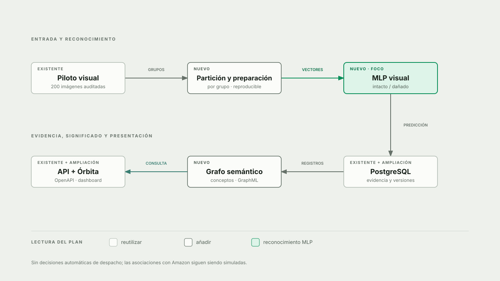

# Plan base — Semana 8: reconocimiento, evidencia y significado

**Estado:** fases 1–6 implementadas y evaluadas; justificación de equivalencias frente a la rúbrica pendiente de consolidar.  
**Alcance:** aditivo sobre el proyecto actual. Las Semanas 2–7, su navegación y sus contratos permanecen iguales.

El [diagrama HTML ampliable](plan-semana-08-diagrama.html) muestra qué reutilizamos y qué se añadiría. El flujo es **imagen → MLP → predicción → evidencia → significado**. La relación entre imágenes y paradas Amazon continúa marcada como *simulada*; el modelo visual no recibe variables de Amazon.

**Resultado inicial:** 150 imágenes (75 %) de entrenamiento y 50 (25 %) reservadas para prueba, por grupo; accuracy MLP **0,48** frente a línea base **0,50**. Esta partición no es la asociación simulada de 200 imágenes con paradas Amazon. El modelo no supera el baseline; se conserva como ejercicio didáctico y no participa en decisiones operativas. Detalle en [el informe](../reports/sem-08-reconocimiento.md).

## Punto de partida

- Ya existen PostgreSQL, migraciones Alembic, API FastAPI documentada en `/docs` y el dashboard Órbita. No se propone reemplazarlos.
- El piloto visual tiene 200 imágenes `side` auditadas: 100 `intacto`, 100 `danado`, con identificador y grupo de origen. Son imágenes sintéticas de control de calidad, **no fotos de envíos Amazon**.
- La vista `MlpView` conserva «Aún no entrenado» como estado vacío, pero muestra métricas y predicciones reales cuando existe un modelo registrado. La versión local inicial ya fue evaluada.
- `../ia-semestre` sirve de referencia académica, no de dependencia. Su `accuracy=0,44` corresponde a un experimento distinto de 100 muestras; no es una meta ni un resultado de este proyecto.

## Entregable de Semana 8

| Pilar de la guía | Aplicación propuesta en `ia-proyecto` | Evidencia verificable |
|---|---|---|
| Red neuronal | MLP supervisado para `intacto` / `danado` a partir de píxeles del piloto; preprocesamiento y semilla documentados | Artefacto versionado, configuración, partición, métricas de prueba y predicciones de ejemplo |
| Base de imágenes | Reutilizar imágenes y metadatos actuales; añadir evidencia de entrenamiento e inferencia en PostgreSQL | Registros consultables por imagen y versión del modelo, con partición y etiqueta real/predicha |
| Ontología didáctica | Grafo dirigido de conceptos y relaciones logísticas, exportado a GraphML | ≥5 conceptos y ≥5 relaciones propias, más un caso enlazado imagen → predicción → clase |
| Sustentación | Informe y visualización en Órbita, consumiendo la API existente | Explicación reproducible del flujo y sus limitaciones |

La guía demuestra `load_digits` + SQLite + NetworkX y muestra nombres de archivos concretos. Son ejemplos de implementación de **reconocimiento, evidencia persistente y significado**. La decisión del proyecto es usar imágenes de paquetes, PostgreSQL y GraphML sin duplicar la base operativa. El informe debe explicar cómo cada alternativa cumple el objetivo evaluado y qué cambia respecto de la presentación.

| Ejemplo de la guía | Adaptación del proyecto | Motivo y verificación |
|---|---|---|
| Dígitos 8×8 y `modelo_mlp.pkl` | Paquetes `intacto`/`danado`, MLP y artefacto versionado en `artifacts/semana08/` | Aplica reconocimiento al dominio; partición, accuracy, baseline y hash verificables |
| `imagenes.db` en SQLite | Metadatos, partición y predicciones en PostgreSQL con Alembic | Reutiliza la base operativa y evita dos fuentes de verdad; consultar registros y pruebas de migración |
| Imagen en Base64, cuando la actividad lo proponga | Originales en almacenamiento privado persistente; metadatos y SHA-256 en PostgreSQL; API por ID | Evita duplicar bytes codificados en la BD y conserva integridad/acceso controlado; comprobar hash y respuesta de archivo |
| `ontologia.graphml` | Grafo GraphML versionado en artefactos de Semana 8 | Mantiene conceptos, relaciones verbales y vínculo con una predicción real; comprobar lectura posterior |
| Versión de Python del ejemplo | Python 3.14 fijado para el proyecto | Unifica entorno local y Docker; ejecutar pruebas y comando reproducible |

El volumen Docker **almacena** imágenes; no es una «imagen Docker» que sustituya
los archivos. La base registra referencias y hashes, y el volumen debe
respaldarse junto con PostgreSQL.

## Secuencia de implementación propuesta

### 1. Fijar datos y protocolo de evaluación

1. Leer el piloto persistido y verificar manifiesto, hashes, etiquetas y archivos antes de entrenar. Fallar explícitamente si falta un dato; no generar sustitutos silenciosos.
2. Dividir por `grupo_origen` antes de cualquier ajuste, con semilla fija y proporciones documentadas. Registrar los IDs y la versión del dataset en la partición para reproducirla y evitar que vistas del mismo paquete crucen entrenamiento y prueba.
3. Definir un preprocesamiento mínimo y reproducible de imagen a vector numérico. El tamaño/resolución final y la arquitectura se fijarán en la implementación y se reportarán; no copiarlos sin evaluación del experimento de `ia-semestre`.
4. Mantener la prueba reservada fuera del ajuste de parámetros. Si se necesita elegir hiperparámetros, usar validación dentro de entrenamiento.

### 2. Entrenar y evaluar el MLP

1. Entrenar un `MLPClassifier` con semilla y dependencias fijadas; conservar configuración, versión, clases y transformación junto al artefacto.
2. Calcular sobre prueba separada: tamaño y balance por partición, `accuracy`, matriz de confusión y precisión/recobrado/F1 por clase. Comparar con una línea base simple para no presentar un número aislado como éxito.
3. Registrar advertencias de convergencia y errores. Si el rendimiento no es convincente, **mostrar la limitación**, no maquillar métricas ni habilitar decisiones operativas automáticas.
4. Serializar y cargar únicamente artefactos producidos por el proyecto; no deserializar archivos suministrados por usuarios.

### 3. Persistir evidencia en la base actual

1. Añadir migración Alembic para ejecuciones/modelos, pertenencia a particiones y predicciones; vincular mediante claves foráneas con `imagenes` y la versión del dataset. Guardar hash del artefacto y parámetros relevantes.
2. Separar etiqueta real de predicción. Una predicción debe indicar imagen, modelo, fecha, clase, y si corresponde, puntuación/confianza; no sobrescribir la etiqueta de origen.
3. Crear lecturas idempotentes y paginadas en `/api/datos` o un router específico de Semana 8, con esquemas explícitos y documentación OpenAPI. El entrenamiento sería un comando reproducible, **no** una operación implícita al abrir el dashboard.

### 4. Representar significado

1. Crear un vocabulario mínimo verificable, por ejemplo `imagen_paquete`, `prediccion_inspeccion`, `paquete_intacto`, `paquete_danado`, `revision_humana` y `paquete`. Relacionarlo mediante verbos legibles (`evidencia_estado`, `produce`, `asigna_clase`, `requiere_revision`, etc.). La selección final debe corresponder a lo que realmente haga el sistema.
2. Conectar al menos una imagen y predicción **persistidas** con su concepto; registrar la versión del vocabulario/grafo.
3. Exportar GraphML **después** de añadir el caso concreto y comprobar por lectura posterior que incluye todas las relaciones. Este grafo es una representación semántica didáctica; no se presentará como razonador OWL ni como regla automática de despacho.

### 5. Mostrarlo sin romper el dashboard

1. Mantener la navegación, vista inicial y pestañas `Laboratorio / Código explicado / Informe` de semanas anteriores.
2. Completar `MlpView` con resumen de datos, método, partición, métricas, matriz de confusión y un ejemplo reservado con imagen, etiqueta real, predicción y versión del modelo.
3. Añadir Semana 8 al workspace didáctico con explicación del código real, informe y visualización sencilla del recorrido semántico. Reutilizar componentes y contratos existentes; no alterar las vistas históricas para hacer caber la nueva.
4. Mantener estados explícitos: sin modelo, datos no disponibles, artefacto incompatible y resultado disponible. Nunca mostrar una predicción inventada.

### 6. Verificar y documentar

- **Pruebas backend:** partición sin fuga, preprocesamiento reproducible, consistencia de etiquetas/hashes, migraciones, persistencia idempotente, métricas, GraphML y respuestas de API.
- **Pruebas frontend:** estados vacíos/error, lectura de resultados reales y regresión de navegación de Semanas 2–7.
- **Informe:** entradas, método, configuración, resultados obtenidos (no esperados), limitaciones del piloto sintético y ejemplo completo de trazabilidad.
- **Criterio de cierre:** `REALIZADO` (archivos y registros existen), `FUNCIONA` (ejecución y pruebas pasan), `COINCIDE` (MLP + evidencia + ontología del dominio), `SUSTENTA` (se puede explicar una predicción de extremo a extremo).

## Fuera de alcance por ahora

- Sustituir PostgreSQL por SQLite o crear una segunda API/documentación API.
- Migrar retroactivamente los laboratorios de Semanas 2–7.
- Usar la predicción visual para autorizar despachos, bloquear paquetes o modificar A* y reglas logísticas. El piloto es demostrativo hasta tener validación suficiente.
- Presentar los paquetes sintéticos como fotografías reales o las asociaciones simuladas con Amazon como relaciones observadas.
- Implementar agentes, motor de restricciones completo o razonamiento ontológico formal del Corte 2.

## Decisiones pendientes para una siguiente iteración

1. Consolidar en el informe la matriz rúbrica → adaptación → motivo → evidencia y verificarla con los comandos y pruebas existentes.
2. ¿Conviene ensayar otra representación o arquitectura para mejorar la línea base? La versión 1 usa gris 16×16 y `(64,)`; cualquier alternativa requiere validación separada, sin elegir por el resultado de prueba actual.
3. La versión 1 conserva solo predicciones del conjunto de prueba. Una futura inferencia sobre imágenes nuevas necesitaría otro tipo de registro y protocolo de evaluación.

## Fuentes revisadas

- `Semana_08_Representaciones_Reconocimiento_Diseno_Semana07.pptx` y `Explicacion_Semana_08.md` (material de clase, disponibles localmente en `~/Downloads`).
- `../ia-semestre/reports/semana08.md` y `../ia-semestre/src/semana08_red_ontologia.py` (referencia académica; no dependencia de ejecución).
- `docs/proyecto.md`, `docs/guia-tecnica.md`, `src/persistencia/imagenes.py`, `src/vision/manifiesto.py`, `api/routers/datos.py` y `dashboard/src/views/MlpView.jsx` (estado del proyecto).

> **Observación de la explicación:** en el código de la presentación, `split='dataset'` no distingue entrenamiento/prueba y GraphML se exporta antes de agregar la predicción de ejemplo. Esta implementación deberá registrar particiones reales y exportar el grafo final completo.
