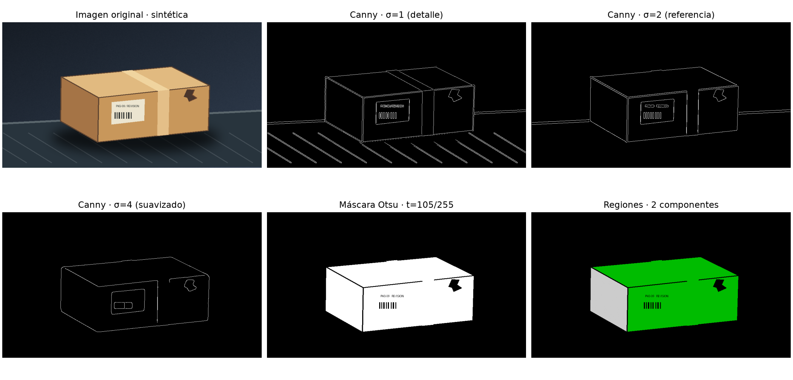

# Semana 9 — Contornos y segmentación de un paquete logístico

**Fecha:** 30 de septiembre de 2026. **Modalidad:** práctica individual en el repositorio acumulativo del Proyecto 8.  
**Tema de clase:** características, Canny, Otsu y regiones conectadas.  
**Entrada:** [`data/imagen_proyecto.png`](../data/imagen_proyecto.png). **Evidencia:** [`artifacts/semana09_vision.png`](../artifacts/semana09_vision.png). **Métricas:** [`artifacts/semana09_resultados.json`](../artifacts/semana09_resultados.json).

## Imagen y relación con el proyecto

La imagen representa **un paquete de cartón sobre una banda transportadora**, con cinta, etiqueta y una rasgadura dibujada. Es una **ilustración sintética propia**, generada de forma determinista por `src/vision/escena_semana09.py`; no es una fotografía de una operación, un envío Amazon ni una muestra del piloto MLP de Semana 8. Mide 960 × 540 píxeles y su SHA-256 es `db3d5b5a0fbc5ee520e5b78bfaa1c062d539ad29c7b3c4aeef015c61cc6bb749`.

Es útil para estudiar una etapa **previa** a la inspección visual logística: localizar límites y separar zonas claras del fondo. No permite validar un detector de daño real ni medir desempeño en imágenes de producción.

## Características seleccionadas

| Característica | Resultado / utilidad |
|---|---|
| Intensidad | Media **71,35/255** y desviación **56,16**. El contraste entre paquete claro y fondo oscuro hace razonable ensayar un umbral global. |
| Color | Media RGB **(74,26; 71,08; 66,29)**. Se conserva la imagen RGB para mostrar el contexto; el procesamiento principal usa intensidad. La media global no distingue por sí sola el paquete. |
| Bordes y forma | Canny resalta el perímetro de la caja, pero también las líneas de cinta, etiqueta y banda. Ayuda a estudiar límites; no identifica semánticamente qué borde es daño. |
| Textura | Las líneas de la banda y el texto de la etiqueta crean detalle de alta frecuencia. Se analizan como posibles falsos bordes, no como un descriptor entrenado. |

## Resultados ejecutados

Se convirtió RGB a gris de 8 bits; Canny recibió intensidad normalizada a `[0, 1]`. Otsu se calculó **sobre la imagen gris original**, no sobre la salida de Canny. La máscara es `gris > 105`; las componentes usan conectividad de **8 vecinos**.

| Paso | Resultado |
|---|---:|
| Umbral automático Otsu | **105/255** (≈ 0,412) |
| Píxeles verdaderos de la máscara | **119.925** de 518.400 (**23,13 %**) |
| Regiones conectadas | **2** |
| Áreas de las regiones | **98.085** y **21.840** píxeles |

La máscara separa casi todo el paquete del fondo. Sin embargo, la línea oscura entre sus caras deja **dos componentes para un solo objeto físico**. Etiqueta y rasgadura aparecen como huecos oscuros; el umbral no los interpreta. Por tanto, «2 regiones» **no** significa «2 paquetes». La forma exterior queda aproximada, pero la segmentación no es perfecta para contar objetos ni medir daños.

### Efecto de `sigma` en Canny

| Sigma | Píxeles de borde | Densidad | Observación de la evidencia |
|---:|---:|---:|---|
| 1,0 | **10.694** | 2,06 % | Se ven detalles de la banda, letras y barras de etiqueta además del paquete. |
| 2,0 | **5.628** | 1,09 % | El perímetro sigue visible con menos detalle de fondo; referencia para esta escena. |
| 4,0 | **3.027** | 0,58 % | Se atenúa la banda, pero desaparecen detalles finos de la etiqueta y algunas líneas. |

Al aumentar `sigma` crece el suavizado gaussiano previo a la detección de bordes. **No cambia** el umbral Otsu ni el conteo de regiones en este pipeline porque ambos se calculan desde la imagen gris, independientemente de Canny. Cambiar `sigma` para «corregir» las regiones, sin modificar la entrada a Otsu, sería una interpretación equivocada.



## Decisiones técnicas y por qué

1. **Escena sintética propia y versionada, no `data.coins()` ni imagen de `ia-semestre`.** La actividad exige adaptación logística y una entrada entregable. Los originales del piloto visual anterior están excluidos de Git y no se redistribuyen; la escena evita copiar su imagen o presentar una fuente externa como propia. El generador y su semilla `20260930` permiten reconstruirla.
2. **Conservar Canny + Otsu + regiones exactamente como conceptos de la clase, pero con imagen y análisis propios.** Esto satisface la rúbrica sin copiar literalmente el ejercicio de monedas ni convertir el trabajo en una clasificación genérica.
3. **Comparar `sigma={1, 2, 4}` y fijar conectividad de 8 vecinos.** Hace observable la sensibilidad de bordes y explícita la definición de región; el resultado depende de esa conectividad.
4. **Publicar la evidencia precalculada por API en lugar de procesar imágenes al abrir Órbita.** La API lee `artifacts/semana09_resultados.json`, verifica el hash de entrada y sirve el PNG; así la vista muestra resultados reproducibles y detecta métricas obsoletas. El CLI es el único responsable de recalcular.
5. **No añadir nueva tabla PostgreSQL ni vincular el paquete a una parada Amazon.** Es un experimento didáctico de una sola imagen, sin evento operativo real. La base de datos existente no ganaría una entidad verificable con esa asociación ficticia.

## Limitaciones y aplicación futura

- Escena única, diseñada para alto contraste y con formas dibujadas: **no mide generalización** ante iluminación variable, cajas reales, oclusión o fondos complejos.
- Otsu global supone separación tonal suficientemente marcada; colores o sombras parecidos al fondo pueden fusionar o fragmentar objetos. La máscara actual deja huecos por contornos oscuros.
- Canny detecta cambios de intensidad, no «rotura». La rasgadura fue dibujada y solo permite examinar si conserva un borde visible; no hay etiqueta de verdad terreno ni evaluación de defectos.
- El número de componentes es una propiedad de la máscara y la conectividad, no una estimación operativa de bultos.

En una fase futura, estas salidas podrían aportar **regiones candidatas** o medidas de forma/textura a una inspección humana o a un clasificador validado con fotografías reales y máscaras anotadas. No se conecta esta práctica al MLP de Semana 8 ni se habilitan decisiones automáticas de despacho.

## Reproducción y verificación

```bash
python -m pip install -r requirements.txt
python -m src.vision.escena_semana09       # reconstruye la imagen; opcional si ya está en Git
python -m src.semana09_vision              # genera PNG y JSON
python -m unittest tests.test_semana09_vision -v
```

La API expone `GET /api/vision-semana09/resultados`, `/evidencia` e `/imagen`; OpenAPI está en `/docs`. Órbita muestra la práctica en Semana 09 con **Laboratorio / Código explicado / Informe**. Los resultados de este informe provienen de la ejecución del script y deben actualizarse si se cambia la imagen o el algoritmo.

**Rúbrica:** realizado = código, entrada, evidencia, informe y dependencias versionados; funciona = CLI, pruebas, API y dashboard ejecutan; coincide = Canny, Otsu, máscara, regiones y análisis interpretado en el dominio del proyecto.
