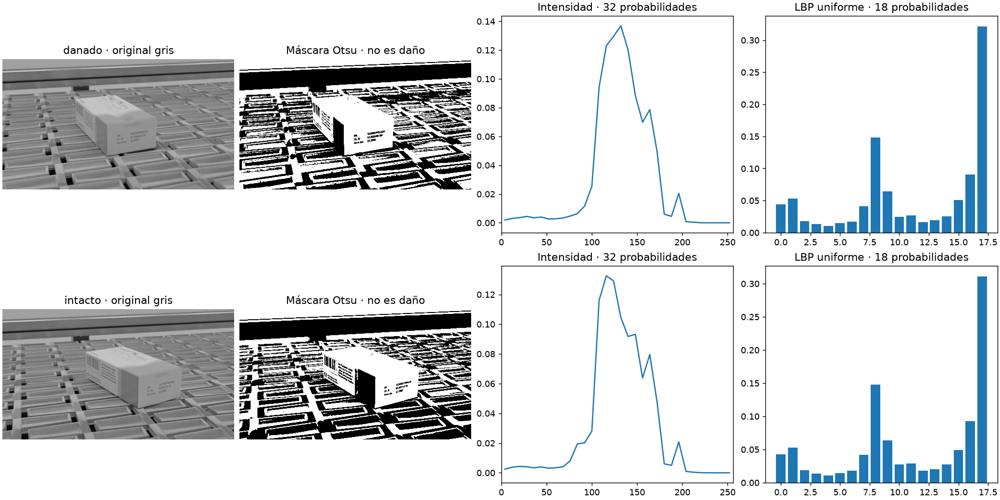

# Semana 10 — Descriptores visuales de paquetes: regiones, intensidad y textura

**Fecha:** 8 de octubre de 2026. **Proyecto:** sistema inteligente para logística.

**Tema de clase:** segmentación mediante histogramas, etiquetado de regiones y texturas LBP.

**Entrada:** piloto auditado de 200 imágenes sintéticas laterales (`data/manifests/piloto-visual-v1.json`).
**Evidencia:** `artifacts/semana10_resultados.json`, `artifacts/semana10_features.npy`, `artifacts/semana10_comparacion.png` y cuatro PNG individuales (`semana10_{danado,intacto}_{gris,mascara}.png`).

## Problema de negocio y alcance

La inspección previa al despacho necesita evidencia sobre el estado físico de un paquete. Esta práctica pregunta si tres familias de características —forma aproximada de regiones claras, distribución tonal y textura local— **describen** las imágenes disponibles y cuáles son sus límites. No entrena un detector de averías ni propone una acción automática.

El ejemplo docente usa `data.coins()` para regiones e intensidad y `data.brick()` para LBP. En el proyecto, los tres bloques se calculan **sobre cada misma vista lateral de paquete**: así una fila del vector corresponde a una observación trazable. `../ia-semestre` conserva el caso académico y no es dependencia de este repositorio.

## Decisiones y método

| Decisión del proyecto | Motivo frente a la clase | Verificación |
|---|---|---|
| 200 originales sintéticos auditados, 150 de entrenamiento para este análisis, 50 reservados sin descriptores de Semana 10 | Evitar usar las imágenes de prueba del MLP para elegir o interpretar descriptores; no mezclar fotografías de Amazon ni la escena dibujada de Semana 9 | Reutilización exacta de partición por `grupo_origen`, semilla `20260925`; IDs y hash del manifiesto en JSON |
| Gris `uint8` a 480×270 con Lanczos | Mantener detalle para LBP, más que el 16×16 del MLP, con costo acotado; originales 960×540 intactos | Dimensiones y parámetros en evidencia; `leer_gris` valida RGB/PNG originales |
| Otsu global + componentes de 8 vecinos; área >50 px | Mantener los conceptos de la guía. El filtro es un umbral exploratorio **a esta resolución**, no una medida física ni calibración operativa | Máscara, región total/válida y caso sin regiones en JSON y pruebas |
| Área media y desviación divididas por número de píxeles; número de regiones separado | Reducir dependencia directa de resolución; no llamar «paquetes» a componentes | Primeros 3 valores del vector; bandera `sin_regiones_validas` distingue fallo de extracción |
| Histograma de intensidad de 32 probabilidades y LBP uniforme (`R=2`, `P=16`) de 18 probabilidades | Son comparables entre imágenes y cada bloque suma 1. La guía usa `density=True`: para bins de intensidad de ancho 8 produce **densidad**, no probabilidades que sumen 1 | Vector 53D = 3 + 32 + 18, orden documentado y pruebas de suma/finitud |
| Histogramas y LBP de toda la escena | No existen máscaras de verdad terreno del paquete para definir una ROI confiable; no inventarla con Otsu | La figura revela la contribución del fondo y la banda |

La matriz `.npy` tiene **150 filas × 53 columnas** en el orden de `ids_entrenamiento` del JSON. No contiene etiqueta ni ID como características. Los dos ejemplos de la figura son los primeros de cada clase dentro del entrenamiento, elegidos de forma determinista, no casos «representativos» elegidos por resultado.

## Resultados observados

| Medida en 75 imágenes por clase | `danado` | `intacto` |
|---|---:|---:|
| Mediana de regiones válidas | 33 | 34 |
| Mediana del área media de regiones (% de imagen) | 1,5138 | 1,4698 |
| Imágenes sin regiones válidas | 0 | 0 |

En los dos ejemplos de la figura, el umbral Otsu fue **131** (`danado`) y **130** (`intacto`); se obtuvieron **32** y **34** regiones válidas. La similitud de esas cifras y de las medianas de clase **no permite afirmar discriminación de daños**. Además, la máscara incluye numerosos segmentos claros de la **banda transportadora**, no solo el cartón. «Región válida» significa un componente de píxeles por encima de 50 px, no un paquete ni una avería.



Una perturbación controlada de **+20 niveles de gris** sobre los dos ejemplos dejó el número de regiones válidas igual, pero cambió el histograma de intensidad (distancia L1 de **0,669583** y **0,696404**); LBP cambió poco (**0,000108** y **0,000123**). Esto ilustra sensibilidad tonal y cierta estabilidad local de LBP **solo en estas dos imágenes y bajo este cambio artificial**. No prueba robustez ante variaciones reales de cámara, sombras, brillo desigual u oclusiones.

## Interpretación y límites

1. **Se cumplió la transformación imagen → vector numérico reutilizable.** Cada una de las 150 imágenes produjo 53 valores finitos y los dos histogramas tienen normalización explícita.
2. **La segmentación no aísla el paquete.** La banda y el fondo dominan partes de la máscara y de la textura. Un descriptor global puede aprender el entorno de captura antes que el daño; hace falta una ROI o máscaras anotadas para medir forma/textura del embalaje con rigor.
3. **No hay métrica de clasificación de Semana 10.** Las etiquetas se emplean únicamente para una comparación descriptiva de entrenamiento; los 50 casos de prueba se auditan para fijar la partición pero no reciben descriptores de Semana 10 ni participan en las estadísticas. No se reporta accuracy, F1, sensibilidad de daño ni mejora frente al MLP de Semana 8 (0,48 vs baseline 0,50).
4. **No hay automatización logística.** La evidencia no autoriza despacho, rechazo, cuarentena ni cambios a A* o al motor de reglas. La revisión humana sigue siendo indispensable.
5. **Generalización no demostrada.** El piloto es sintético, de un diseño de empaque y un escenario de banda; no representa envíos Amazon reales. Los originales se conservan localmente y no se redistribuyen en Git; el manifiesto y las evidencias calculadas sí permiten auditar qué se procesó. En otro equipo se necesitan originales autorizados para regenerar los artefactos.

## Reproducción y comprobación

```bash
python -m src.semana10_texturas
python -m unittest tests.test_semana10_texturas -v
cd dashboard && pnpm test && pnpm build
```

La API expone `GET /api/vision-semana10/resultados`, `/evidencia` y `/ejemplos/{clase}/{tipo}` desde archivos **precalculados**, comprobando hashes de manifiesto, código, matriz, figura e imágenes individuales. En Órbita el laboratorio permite **Ambos / Dañado / Intacto**: cada caso conserva imagen, máscara y descriptores propios; las gráficas Nivo se superponen solo cuando se seleccionan ambos. El PNG de Matplotlib permanece como evidencia técnica desplegable. Las pestañas **Laboratorio / Código explicado / Informe** no cambian. Abrir la vista no ejecuta extracción.

**Criterio de cierre:** realizado = código, matriz, figura, JSON e informe; funciona = CLI, pruebas, API y frontend; coincide = segmentación por histograma/Otsu, regiones etiquetadas, textura LBP y comparación de dos imágenes del proyecto. La conclusión negativa sobre aislamiento del paquete forma parte del resultado, no es un fallo que deba ocultarse.
